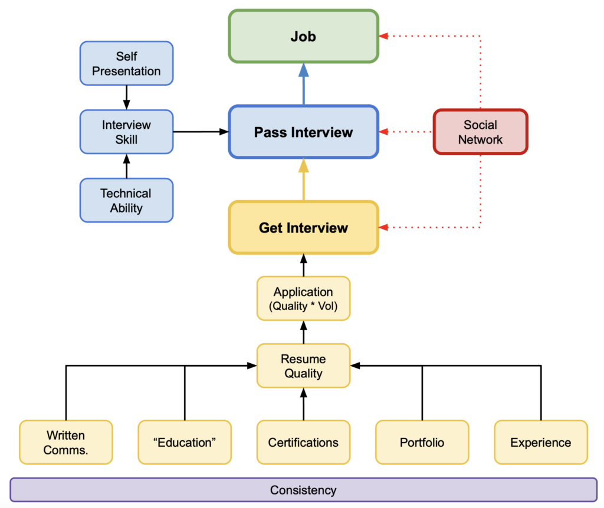

Have you ever wondered what it takes to be highly employable? Perhaps you've just recently jumped into the adult world of job hunting and you're feeling a little lost in the process. I know the feeling; my first job hunt seemed to stretch on forever.It felt quite challenging and sometimes even seemed like dumb luck when I finally landed a job. The fear of losing that job and finding myself jobless again was pretty overwhelming. It made me think a lot about how I could improve my skills and make myself more employable in the long run. This led me to create the 'Employability Framework'. Let me explain what this is and how it can help you improve your career prospects.

### **About the Employability Framework**

The Employability Framework is a strategy that I developed to help job seekers improve their employability. It has been a valuable tool in my career journey, helping me go from almost having nothing to landing a job with a base salary of 180K! But what does this framework look like? And how can you use it to improve your employability too?

Here's a visualization:

The framework revolves around two primary areas:

- Getting an interview
- Passing the interview

These are the two key steps to landing a job. Almost every activity in your quest to become highly employable should aim to improve these areas.

#### **How to Get an Interview**

The first step is to get called for an interview. To do this, you need to submit plenty of high-quality applications. How do you do that? Here are some tips:

- Create a high-quality resume: Pay close attention to spelling and grammar, use a consistent font, and have relevant sections such as education, certifications, portfolio, and experience. And don't forget to showcase quantifiable experience
- Connect with people on LinkedIn: For each application you submit, reach out to one person from the company on LinkedIn. It might not guarantee a job but networking is always beneficial
- Track your applications: Use an application spreadsheet to keep track of where you've applied

Check out this video about how to use ChatGPT to crush an interview:

[Watch on YouTube ↗](https://youtu.be/UkHXSYtl7cE)

#### **How to Pass the Interview**

Once you've gotten the interview, the next step is passing it. The key lies in sharpening your interview skills. Here are some tips:

- Create a high-quality resume: Pay close attention to spelling and grammar, use a consistent font, and have relevant sections such as [education](https://youtu.be/epx5ogmawPo), [certifications](https://youtu.be/XOxR7ZGpQSk?si=uDBTgUpGc3Ce9xnd), [portfolio](https://youtu.be/zgqfWLHNKLk?si=4ha4e2dXiQitmDi5), and [experience](https://youtu.be/UasHPQ0VBOc). And don't forget to showcase quantifiable experience
- Connect with people on LinkedIn: For each application you submit, reach out to one person from the company on LinkedIn. It might not guarantee a job but networking is always beneficial
- Track your applications: Use an [application spreadsheet](https://docs.google.com/spreadsheets/d/1eH38clIIcEoEZtYFQHw1u9VZgIqtPRK3BhkDUcEw8Fw/edit#gid=0) to keep track of where you've applied

[55 Sample Cybersecurity Interview Questions](https://docs.google.com/document/d/12XyjB9kYAIbep0eM9GZteOgkr1mFIPhg3vZQlxotKW4/edit)

### **Enhancing your Employability**

In addition to the framework, you can enhance your employability by:

- Working on your self-presentation: Pay attention to your physical appearance and comportment
- Improving your technical ability: Showcase your skills and knowledge in your chosen field
- Building a social network: Maintaining good relationships and connections with people in your field can open doors for you in your career

### **Conclusion**

The Employability Framework is a practical guide to increase your odds of landing a job and enhancing your career prospects. While there's always a bit of luck involved in job hunting, being strategic about it makes a huge difference.Remember, whether you're just starting or you're looking to change careers or jobs, you have what it takes to become highly employable! And remember, the Employability Framework can be applied to most disciplines. It’s not just about IT or cyber-security. So think about your career, apply the framework, and keep building those skills. Good luck with your job hunt and future career!

Don’t forget to check out my Hands-On IT and Cybersecurity Course to help you bridge the gap between just being skilled and actually landing a job!

<https://joshmadakor.tech/it>

<https://joshmadakor.tech/cyber>
