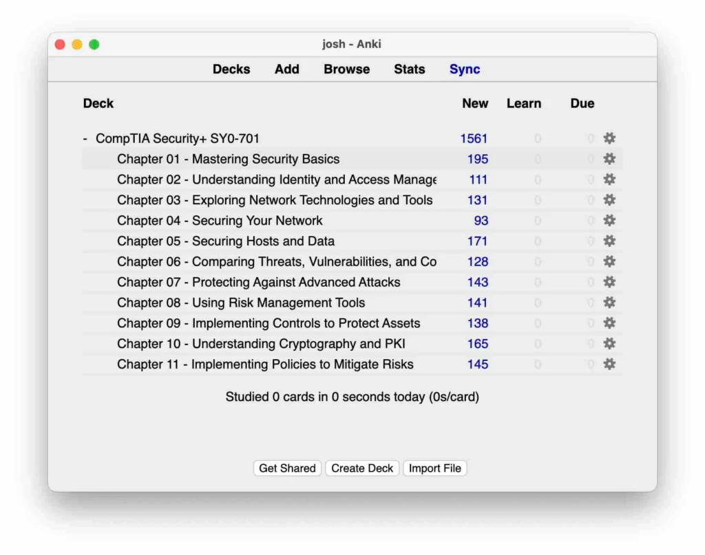

Are you ready to obtain your CompTIA Security Plus certificate with ease? Great! Today, we're going to show you how to prepare for the Security Plus exam, discuss a three-phase approach to pass the exam, and even share a secret on how you might save $70 on your certification. Stay tuned till the end, as we'll also discuss how to transition into a cyber security job position!

## **Free Practice Questions**

CompTIA updated its exam objectives last November, but don't worry, we have prepared over 1500 practice questions that follow the new objectives. The best part? These practice questions are absolutely free! You can easily use these questions online in a browser from anywhere. We'll walk you through the process. Instead of grouping the practice questions by objectives, this time, we organized them by chapter.

- **Choosing a Chapter:** First, you need to choose a chapter you want to work on. Let's say you pick Chapter 1: Mastering Security Basics.
- **Starting the Test:** Once your chosen test loads, click 'Start' and begin answering the questions.
- **Selecting an Answer:** Next, you select the response to a question and will instantly see if the answer was right or wrong. Importantly, each question comes with a full explanation of the correct answer, including a reference to the study book we used, authored by Daryl Gibson.

### **You can access the practice questions on our company website!**

[Get Free Security+ Practice Questions](https://lognpacific.com/free-certification-practice-tests/free-security-sy0-701-practice-questions)

## **Offline Version of the Practice Questions**

If you prefer studying offline, good news! You can download the offline version by entering your email on our website. A deck will be sent to your email, which you can use after installing the app 'Anki' on your computer or phone. The offline version is beneficial as it keeps track of your progress and aids you in identifying incorrect answers for future revision.

#mc\_embed\_signup {
background: #fff;
clear: right;
font: 14px Helvetica, Arial, sans-serif;
max-width: 800px;
width: 100%;
color: #111 !important;
}
.button {
background-color: black !important;
color: white !important;
text-align: center;
display: block !important;
width: 100%;
padding: 10px;
border: none;
cursor: pointer;
}

## Sign up to get your FREE CompTIA Security+ deck!

\* indicates required
Email Address \*

First Name \*

Last Name \*

The deck should arrive in your email shortly!

## **How to Get $70 off Security Plus**

Would you like to get a $70 discount on Security Plus? All you need to do is complete [Google's cyber security program](https://joshmadakor.tech/google) that comes with a 30% off coupon. This program costs $50 per month, but by getting the voucher, you basically get Security Plus at a reduced price. This hack might sound weird, but that's the current reality. Please check out the analysis video below for more information about the pros and cons of both Google’s cyber security program and Security Plus.

[Watch on YouTube ↗](https://www.youtube.com/watch?v=kwA6B610ONE)

## **Three-Phase Approach to Pass Security Plus**

Let's break down my three-phase approach on how to pass Security Plus if I were to take it today:

- **Priming phase:** In this phase, you'll quickly go over what you'll study. Get a general overview of the content.
- **Learning phase:** This is when you dive into the details. Take your time, and make sure you understand every concept.
- **Polishing phase:** After you've seen everything once, use the polishing phase to go back through and strengthen those areas that are difficult for you.

Remember to use the practice questions and materials provided. And once you've passed the Security Plus, you can now dive into the world of cyber security jobs. We have a course just for that!

## 

## **Conclusion**

We hope you're feeling ready to soar high in your cyber security career. Remember, preparation is key. With this blog post, you've got all you need to ace the Security Plus exam. Now, it's time to get studying! We'll watch you shine in the world of cyber security.

Don’t forget to check out my Hands-On IT and Cybersecurity Course to help you bridge the gap between just being skilled and actually landing a job! Until next time, keep exploring!

<https://joshmadakor.tech/it>  
[https://joshmadakor.tech/cyber](https://www.skool.com/cyber-range/about?ref=df64395c5eb243e79ae1be7b3a40f59a)
