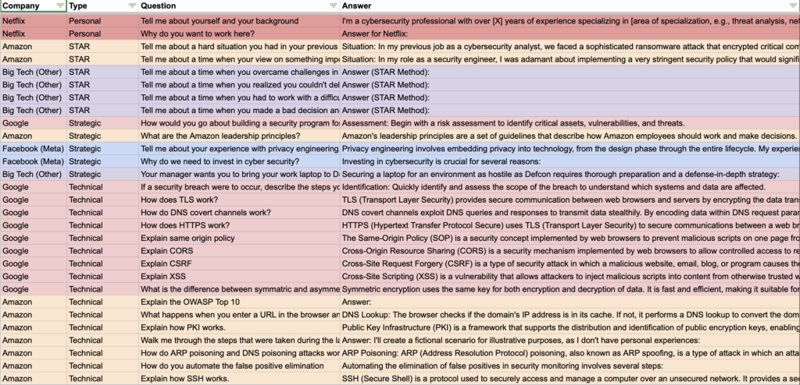

Welcome, budding young tech enthusiasts! Have you always dreamt of working for the biggest technology companies globally, fondly known as FAANG? The acronym stands for Facebook, Amazon, Apple, Netflix, and Google. In this post, we will learn about preparing for Cyber Security Engineer interviews at these top firms.

## **A Peek into the Strategy**

Our unique approach here involves scrutinizing 50 specific Cyber Security Engineer interview questions. We've gathered these from websites like Glassdoor and Teamblind. Our strategy is simple: if you can anticipate and reasonably answer FANG-level questions, you can probably do okay for most companies out there, not just the big tech giants.

Let's now understand the different types of interview questions you may face, my personal interview experiences at FANG, and some essential tips for acing your interview!

[Watch on YouTube ↗](https://youtu.be/wVOU-oLOGuk)

## **Understanding the** [**Spreadsheet**](https://docs.google.com/spreadsheets/d/1IrTAb2-4zxcDc1t9snG2ls8nIo3PNiA4wh5VaqF8HGA/edit#gid=0)

The [spreadsheet](https://docs.google.com/spreadsheets/d/1IrTAb2-4zxcDc1t9snG2ls8nIo3PNiA4wh5VaqF8HGA/edit#gid=0) we created has several columns: Company, Question Type, Question, and Answer. Here's what they represent:

- **Company:** This shows which company reportedly asked the question.
- **Question Type:** We'll talk about this more later, but this provides a general idea of the topic of the question.
- **Question:** This is the interview question as reported by people on Teamblind or Glassdoor.
- **Answer:** We've used an artificial intelligence model, Chat GPT, to formulate a professional-sounding answer to each question.

**Remember:** While studying these questions, you don't need to memorize the answer. It's enough if you understand the question and the answer. You should then aim to articulate your answer to the question.

## **Types of Questions**

Based on the type of question, they generally fall under the following categories:

- **Security Operations and Engineering:** These are the most common questions in Cyber Security interviews.
- **Design:** These technical questions revolve around the architecture and design of systems.
- **Software Coding:** These questions test your coding skills. While not as intensive as software engineering interviews, coding questions do show up in security engineering interviews.
- **Technical:** These questions test your understanding of specific technical concepts.
- **Strategic:** These questions evaluate your strategic thinking and planning skills.
- **Situational/Star format:** Such questions generally begin with phrases like "tell me about a time when...". They measure your behavior and response to specific situations.
- **Personal:** These questions help the interviewer get to know you better.

## **Important Interview Tips**

Now, let's go over some interview tips to make sure you do your best!

- **Articulate your answers:** Practice explaining your thought process and solutions aloud, improving your ability to articulate your answers.
- **Practice Star format questions:** These can be tricky, so it's best to prepare some responses in advance following the Star method.
- **Coding practice:** Make sure to practice coding on platforms like LeetCode or AlgoExpert before appearing for the interview.

[Watch on YouTube ↗](https://youtu.be/GQEKp32svPk)

## **Conclusion**

Preparing for a cyber security engineer interview might seem like a daunting task, but remember, practice is key. Make use of resources like practice questions and courses to improve your skills. And never hesitate to explore deeper and learn more. Good luck with your interview preparation, future tech leaders!

Don’t forget to check out my Hands-On IT and Cybersecurity Course to help you bridge the gap between just being skilled and actually landing a job!

<https://joshmadakor.tech/it>

<https://joshmadakor.tech/cyber>
