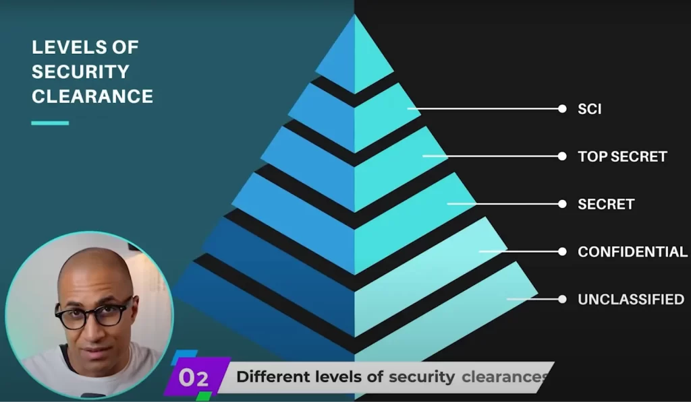

#### Table of Contents

Hey everyone!

Less than 1.3% of people in the US have a security clearance. But with one, you have access to really high-paying IT and cyber security jobs all around the world that most people cannot even apply to. So if job stability and high income is your thing and you're interested in getting a security clearance, definitely keep reading!

## What is a Security Clearance【Gateway to the $119,131 World】

Basically, a security clearance is like a stamp of approval on your person. It's a certificate of trust that the government gives you after thoroughly investigating your entire life—official recognition that you're worthy of handling classified national information.

### 3 Reasons Why Clearance is the Ultimate Weapon

**Reason 1: Access to Exclusive Job Markets** With upper-level clearances, you can access defense, national security, and government agency positions worldwide, and you'll be extremely highly valued in the job market. I mean, you can apply to jobs that 99% of the population can't even apply to.

**Reason 2: Record-Breaking Salaries** According to Clearance Jobs' "2025 Security Clearance Compensation Report," average salaries reached an all-time high of $119,131. That's a pretty good number, right?

**Reason 3: Career Advancement Opportunities** Many companies offer special salary increases and unique career paths specifically for clearance holders. Basically, you get special treatment that others don't.

### 3 Main Levels (Confidential・Secret・Top Secret)

There are basically three main levels, with an even more special designation at the very top: Confidential: This is the entry level. It handles information that would cause "measurable damage" to national security if disclosed. Secret: Mid-level. Information that would cause "serious damage" if leaked. Personnel with this level are really highly valued. Top Secret: The highest level. Handles the most classified information that would cause "exceptionally grave damage" if disclosed.

### The Peak: TS/SCI and Career Impact

Above Top Secret, there's **SCI (Sensitive Compartmented Information)**—an even more strictly controlled special category. TS/SCI (Top Secret/Sensitive Compartmented Information)—this is the pinnacle of clearances. Since it handles really important information vital to national foundations, you need to go through additional rigorous screening. If you can secure TS/SCI positions, that means major career success.

## 3 Essential Requirements for Getting Clearance

### Requirement 1: US Citizenship

This is an absolute requirement. You have to be a US citizen. Permanent residents or other statuses basically won't work. There might be some special cases occasionally, but generally you need citizenship.

### Requirement 2: Proving Expertise Through IT Certifications

For IT positions, you need to objectively demonstrate your expertise. IT certifications are the most effective way. CompTIA Security+ serves as the baseline for many job postings, and if you have CISSP certification, you'll be seen as top-tier talent.

To be honest about my experience, when I got my first job, I had a bunch of certifications, but the ones that really made the difference were CISSP and CCNA. Those two made the decisive difference.

Make sure to check out our free resources too!

[CompTIA Security+ Practice Test](https://lognpacific.com/free-certification-practice-tests/free-security-sy0-701-practice-questions/)
[Free CISSP Practice Test](https://lognpacific.com/free-certification-practice-tests/free-cissp-practice-questions/)
[Free CCNA 200-301 Anki Deck](https://lognpacific.com/free-certification-practice-tests/free-ccna-200-301-practice-questions/)

### Requirement 3: Proving Good Moral Character

"Good moral character" might sound vague, but it's actually a very rational screening process. Basically, they're checking whether you're someone who can't easily be compromised.

What investigators are looking at is whether there's any risk of you becoming a target for threats or bribery from foreign intelligence agencies:

- **Criminal History**: Felonies are considered extremely serious concerns.
- **Drug Use**: Current use of federally illegal substances is a no-go (but if you honestly disclose past use, it might be taken into consideration).
- **Financial Status**: Bankruptcy or major debt defaults might be seen as risks for monetary bribery.

**The Absolute Rule**: Never lie on your SF-86 application form. This extensive document details your entire life. False statements result in immediate rejection and permanent loss of trust.

The clearance process flow is **"Get Certifications → Apply to Sponsor Company Jobs → Company Applies → Investigation → Pass."** 　Don't worry—there are established methods for dealing with rejections and recovery procedures at every stage.

## How to Find Sponsor Companies【Practical Methods】

### Effective Search Keyword Strategy

Now, how do you find sponsor companies? This is the important point. Don't search "security clearance jobs"—that only shows positions for people who already have clearances.

Instead, search Indeed, LinkedIn, and other job sites using these exact phrases in quotes:

- **"ability to obtain a security clearance"**
- **"ability to maintain a security clearance"**

These keywords are the magic words for finding companies willing to invest in potential talent like you and become sponsors.

### My Personal Experience: The Key is "Strategic Flexibility"

Finding your first sponsored position is honestly difficult because there just aren't that many of them. My advice: Be as flexible as possible.

Let me be honest about my case. At the time, I was working in the US making $75,000, but to get my first clearance, I took a job in Japan making $50,000. So I moved to the other side of the world and took a pretty big pay cut. Well, I liked Japan so it wasn't that bad... but I still did it.

Consider relocating too—these kinds of jobs are concentrated on the East Coast, especially Washington D.C. and Maryland. Whether you're willing to move for your first career step often becomes the key to success.

## What to Do If You're Worried About Your Past

Just because you had some problems in the past doesn't mean you need to give up.

Check out the [DOHA (Defense Office of Hearings and Appeals)](https://doha.ogc.osd.mil/Industrial-Security-Program/Industrial-Security-Clearance-Decisions/ISCR-Hearing-Decisions/) government website. It publishes actual cases where people who were initially denied clearances ultimately won approval through formal appeals.

You can't change the past, but if you can prove that you're currently a trustworthy person, doors will open. As I mentioned in previous videos, even felons can sometimes get clearances. It all depends on the adjudicator and the circumstances.

## Concrete Actions to Start Right Now

Security clearance is truly a powerful weapon that can transform your career. It requires effort, honesty, and strategic flexibility, but the returns are immeasurable.

If you're serious, the first step you should take is clear:

Start studying for high-market-value foundational certifications like CompTIA Security+ right now! This is the best way to show future employers your commitment and potential.

### How to Prove Practical Skills

After proving your knowledge through certifications, what hiring managers look at next is "What can this person actually do?"—your practical abilities.

Of course, developing skills through self-study is a wonderful challenge. But you'll hit the wall of how to objectively prove those skills and differentiate yourself from other candidates.

That's where I put all my 15 years of field experience into developing "Cyber Range."

I recommend starting with our free Cyber Community first.

Here you'll find:

- Access to real enterprise-grade security tools
- Networking with 5,500+ active professionals
- Basic learning resources and guidance

Then when you're ready, you can gain "actual corporate environment internship experience" with the more comprehensive Cyber Range. This isn't just a learning course—together with 1,200+ members, you can handle real threats in a live SOC and build verifiable hands-on experience that you can put on your resume.

Start by getting a feel for the free Cyber Community first, and when you feel you need the next level, consider Cyber Range!

[Cyber Community](https://www.skool.com/cyber-community/about)

One last piece of advice: Don't aim for perfection. I recommend starting with Secret level rather than going straight for Top Secret. Once you're in the system, moving up to the next level becomes relatively easy.

I'm rooting for you! Looking forward to meeting you in that special 1.3% world.

## Frequently Asked Questions About Security Clearance (FAQ)

Q1: Is it really possible for someone with no experience to find a sponsor?

A: It’s challenging but not impossible. Success requires strategy and flexibility: Search for jobs using the magic keywords: “ability to obtain a security clearance” Get required certifications first (CompTIA Security+, CISSP, CCNA) Stay flexible about salary and location in the early stages

Q2: Why can't I find a job even though I have clearance and certifications?

A: Clearance is extremely valuable, but it’s just the “key to getting application eligibility”—it doesn’t guarantee hiring. In addition to clearance and certifications, work experience, skill sets, and interview performance are important. I recommend reviewing potential mismatches between the positions you’re applying for and your skill set, resume writing, and interview preparation.

Q3: Do clearances have expiration dates?

A: When you leave positions requiring clearance, your clearance becomes “inactive,” but it doesn’t completely expire. Generally, reactivation is possible within 24 months. For longer periods, complete reinvestigation is usually required.

Q4: Do student loans affect the screening?

A: The important factor is whether you’re fulfilling your payment obligations. Student loans alone rarely cause problems—investigators focus more on whether you’re responsibly managing repayment plans rather than the debt amount itself.

Q5: Can dual citizens get clearances?

A: It’s possible but requires stricter screening. You need to prove you’re immune from undue influence by foreign governments. Loyalty assessment (Guideline C: Foreign Preference) is carefully evaluated case by case.

Q6: I made false statements at a recruiter's instruction in the past. Will this be discovered?

A: The possibility of discovery is very high. Security clearance background investigations are extremely thorough, and past application documents can also become investigation targets. The most important thing is being honest. The best path is to honestly record everything on this SF-86 and explain the circumstances of the past. If lies are discovered, it leads not only to rejection but potentially permanent loss of federal government job opportunities.

A: It's challenging but not impossible. Success requires strategy and flexibility: Search for jobs using the magic keywords: "ability to obtain a security clearance" Get required certifications first (CompTIA Security+, CISSP, CCNA) Stay flexible about salary and location in the early stages

A: Clearance is extremely valuable, but it's just the "key to getting application eligibility"—it doesn't guarantee hiring. In addition to clearance and certifications, work experience, skill sets, and interview performance are important. I recommend reviewing potential mismatches between the positions you're applying for and your skill set, resume writing, and interview preparation.

A: When you leave positions requiring clearance, your clearance becomes "inactive," but it doesn't completely expire. Generally, reactivation is possible within 24 months. For longer periods, complete reinvestigation is usually required.

A: The important factor is whether you're fulfilling your payment obligations. Student loans alone rarely cause problems—investigators focus more on whether you're responsibly managing repayment plans rather than the debt amount itself.

A: It's possible but requires stricter screening. You need to prove you're immune from undue influence by foreign governments. Loyalty assessment (Guideline C: Foreign Preference) is carefully evaluated case by case.

A: The possibility of discovery is very high. Security clearance background investigations are extremely thorough, and past application documents can also become investigation targets. The most important thing is being honest. The best path is to honestly record everything on this SF-86 and explain the circumstances of the past. If lies are discovered, it leads not only to rejection but potentially permanent loss of federal government job opportunities.
