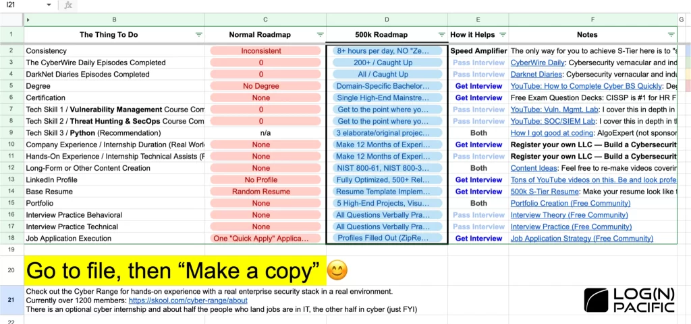

#### Table of Contents

First, let me be honest with you.

**Making 5 million dollars a year in cybersecurity isn’t about landing that dream CISO role at Google or Apple.** The competition there is just too intense, and honestly, it’s a hassle. So, what’s a more practical strategy? **It’s becoming a highly skilled individual contributor who can handle multiple remote contracts at once.**

In this article, I’ll break down a realistic approach to earning five million dollars in cybersecurity, including the types of roles to pursue (and avoid), and how to level up your skills efficiently.  
**Before we dive in, here’s one important note:** actually implementing what I discuss requires serious focus and a big investment of time. But don’t feel pressured to do everything perfectly—you should move at your own pace.
That said, anyone who’s reached this income level in a healthy and ethical way will probably find themselves nodding along to much of what’s shared here.

**To give you some context from my own journey, in 2022 I made $2.37 million from just two cybersecurity contracts (without really trying to maximize my income).** The following year, combining regular cybersecurity work with my own entrepreneurial ventures, **I earned $8.7 million.** I could have leaned into taking on even more contracts, but ultimately I chose entrepreneurship because, honestly, it was a lot more fun for me.

## The Overall Strategy for Hitting $5OOK Annually

The strategy to earn $500K a year in cybersecurity is to work as a highly skilled individual contributor across multiple domains and juggle multiple contract gigs at once.  
The key point here is that as you raise your skill level in any domain, the time and energy required for tasks drop dramatically. For example, if you can finish an eight-hour job in just two hours, you suddenly have time for other contracts too.

## How to Choose Your Work: “Contracts” & Flexibility Are Everything

If this is your very first job in cybersecurity, **my advice is to take any opportunity you can get.** Give it your all, learn as much as possible on the job, and work seriously. For that first role, it honestly doesn’t matter what it is. The advice I’m sharing below is for when you’re searching for your second and third jobs.

### Contract vs. Full-Time Employment: The Numbers Tell the Story

A lot of people aim for full-time roles, but I’m going to recommend contract positions.

1. Three reasons you should go for contract work:  
   **Higher base salary:** Contract gigs (especially remote ones) often advertise annual pay in the $111,000-$175,000 range, and they’re almost always more lucrative on an hourly basis.
2. **Easier to get hired:** The hiring process is much simpler compared to full-time positions. I’ve personally been hired at Microsoft without even an interview.
3. **More specialized tasks:** As a contractor, your role is much more focused—you’re rarely expected to take on a wide range of unrelated tasks like you would as a full-timer.

### What Roles to Target—And Which to Avoid

Opt for a position that offers a good degree of flexibility.For instance, jobs that require you to be constantly on-call at specific times and places—like incident response—end up limiting your time, making it tough to maximize your income.

**Recommended roles:**

- **Vulnerability Management:** This kind of work lets you move at your own pace, and since you’re often waiting on others to finish tasks, you don’t have to spend all day glued to your keyboard.
- **GRC (Governance, Risk, and Compliance):** This is largely about defining policies and documentation, meaning you can deliver results much more efficiently.

**Roles to avoid:**

- **SOC (Security Operations Center) and Incident Response:** Lots of emergency work and tough scheduling.
- **Cloud Support Engineers (like AWS or Azure):** You’ll be dealing with constant problems and it’s hard to predict your workload.

## Mindset Shifts for Success

Note: What follows might sound a little extreme, but it’s absolutely doable to succeed while maintaining a healthy work-life balance. Don’t burn yourself out! People who thrive in these types of careers often go through a major mindset shift. I personally experienced two big changes as my income grew.

### Reevaluating Relationships

This is something I went through myself, but everyone’s situation will be a bit different. **Setting ambitious goals takes a ton of time and energy.** Along the way, you may realize that some relationships are huge drains on both. At that point, you’ll face choices about how you spend your time and energy. I found some of my friendships shifted—and simultaneously met new people who shared my goals. **Just remember: you don’t need to sacrifice your most important relationships. Finding balance as you grow is the healthiest approach.**

### The Evolution of Your Money Mindset

**My attitude toward money changed in stages.** If you’d asked me as a broke teenager stocking shelves at a supermarket, “What would you do with a half-million dollar salary?” I probably would have rattled off a list of cars like a WRX and Lamborghini. But after putting in the hard work and actually earning serious money, **I realized how much more important it is to manage my time rather than collect stuff.** I still think nice cars are cool, but these days, I’m happier spending my commute relaxing in an Uber than showing off a Lamborghini.

## The Foundation for Sustainable Success

To juggle multiple gigs and do it right, these three elements are a must:

1. **HP (Health & Physical Strength)**
2. **MP (Mental Energy & Motivation)**
3. **Halo Effect (First Impressions)**

### Optimizing Health and Performance

Managing your physical health and mental energy is absolutely crucial for giving your best performance. The halo effect is a kind of cognitive bias: "if your first impression isn’t great, people will struggle to see past it, and it can take a while to earn their trust."

So, I highly recommend taking care of your health wherever you can. Recently at “Skool Games”—an entrepreneurial competition where winners got invited to Los Angeles—I was amazed at how many participants were seriously fit. Staying in shape makes people see you as disciplined and naturally leads them to believe you’ll deliver great results at work, too.

If you don’t know where to start, check out the “75 Hard” program. I’ve done it myself and I highly recommend giving it a shot.

## The Practical Roadmap: Hitting $5 Million in Two Years

Let’s dive into the “**Cybersecurity Roadmap**” that I personally use. This isn’t just any ordinary roadmap—it’s the special edition built specifically for shooting for a $5 million annual income.

Normally, our Cyber Community provides a standard Roadmap to help people break into cybersecurity jobs as efficiently as possible. But for readers of this article, I’ve prepared a special version for those aiming to hit the $5 million mark in the industry.

Important note: What’s laid out below is an intense approach, so make sure you prioritize your health and work-life balance. Take what works for you, and don’t try to force everything at once!

## How to Use the Roadmap

The left side lists key elements, the right shows proficiency levels—with S-rank being the highest.
 

Feel free to grab and copy both the $500k Cyber Roadmap and the standard Cybersecurity Roadmap—they’re available for download at the bottom of this article. If you’d like to use them, just scroll down and check them out!

## The 10 Essentials

1. **Consistency:** Aim for 8 hours a day, every day, without skipping. It sounds extreme, but it’s what I genuinely do—and the only way to pull this off is to cut out bad dopamine habits. That means cutting things like constant TikTok scrolling and finding satisfaction in your work and studies instead.
2. **Information Gathering (Cyber Daily):** Listen to podcasts like “Cyber Daily” and “Darknet Diaries.” You’ll learn the industry lingo and trends, which can really help in interviews.
3. **Degree:** Get a bachelor’s degree if you can. Western Governors University offers a cybersecurity Bachelor’s accredited by the NSA—and lots of certificates are included.
4. **Certifications:**  
   Get one high-level certification (like CISSP)  
   One mid-level certification (like CISA or CCNA)  
   A couple of specialist certs (like SC-100, AZ-500)  
    **Don’t forget to use our free exam prep resources, too!  
   ・[Free CISSP Practice Exam](https://lognpacific.com/free-certification-practice-tests/free-cissp-practice-questions/)  
   ・[Free CISA Anki Flashcards](https://lognpacific.com/free-certification-practice-tests/free-cisa-2024-2029-practice-questions/)**  
   ****・[Free CCNA Anki Flashcards](https://lognpacific.com/free-certification-practice-tests/free-ccna-200-301-practice-questions/)****
5. **Tech Skills:**
Build advanced labs and document your work. Eventually, you’ll want to be able to build from memory alone, but start with documentation and grow from there.**Programming is also key**—so don’t just rely on ChatGPT. Use it as a support tool to learn practical coding skills.
6. **Practical Experience:**
You’ll need two types:
Company-based “on resume” experience
Actual “hands-on” experience
I recommend forming your own LLC, building cybersecurity products or sandbox environments, and letting real users try them. The goal here is learning and experience—not profit.
7. **Content Creation:**
Produce high-quality content—blog posts or videos—covering NIST publications or technical lab builds.
8. **LinkedIn:**
Forge at least 500 relevant connections and fully optimize your profile.
9. **Portfolio & Interviews:**
Build a solid portfolio and take interview practice seriously.
10. **Job Applications:**
Skip “easy apply” buttons; tailor your resume for each position and use keyword searches to hunt down strategic roles.  
    If you work through this roadmap at your own pace, you’ll become a highly marketable candidate—and see a real spike in interview requests.

**Realistic Timeline:** Doing all this within two years is what I’d call the ideal for someone working extremely intensively. For most people, a longer-term, steady approach is much healthier and more sustainable.

## Last: Your Health and Happiness Matter Most

Thank you for reading this far. While this article is all about hitting five million dollars in annual income, I really want to emphasize what matters most. Your mental and physical health is absolutely critical. Long hours and juggling multiple contracts may get results, but it’s totally pointless if you burn out. Find a pace and method that lets you keep going.

**You don’t need to sacrifice your most important relationships, either.** Growth is about striking the right balance. Not every part of this strategy will be right for everyone—and that’s perfectly okay. Discover what works best for you.

If you found any of this useful, that’s wonderful—but above all, I hope you stay healthy and live a happy, fulfilling life. Even as you strive for cybersecurity success, don’t forget to prioritize yourself.

### Start Your Cybersecurity Learning Journey!

In our Cyber Community, you’ll find members from all sorts of backgrounds: people switching careers and aiming for their first job in cybersecurity, seasoned pros wanting to skill up, and even hobbyists joining for fun.

**If you join our community, you’ll be able to:**

- Ask questions for free
- Get thoughtful answers from experienced members to serious queries
- Connect with others who share your goals

**If you’re interested, check it out!**

[Cyber Community](https://www.skool.com/cyber-community/about)

I’m rooting for your healthy, sustainable growth all the way!

## The Roadmap sheet is here.

Click to copy the spreadsheet and use it.

[Standard Cybersecurity Roadmap](https://docs.google.com/spreadsheets/d/1QJHR54mpa-zcx2iBqCLb4EKD-4UmHZcXNO2xYZ5KQss/edit?gid=0#gid=0)
[500k Cybersecurity Roadmap](https://docs.google.com/spreadsheets/d/1QJHR54mpa-zcx2iBqCLb4EKD-4UmHZcXNO2xYZ5KQss/edit?gid=0#gid=0)

## Frequently Asked Questions About Security Clearance (FAQ)

Q. If I want to switch to the tech industry without an IT background, which is better: WGU’s Cloud & Network Engineering (AWS/Cisco) or Cybersecurity?

A. There’s no single “right” answer—it depends on what kind of career you want to build.

- If you specialize in Cybersecurity and earn cloud certifications, you can become a cloud-savvy security professional (e.g., cloud security analyst, SOC analyst, cloud vulnerability management specialist).
- If you major in Cloud & Network Engineering and add security certifications, you’ll be a security-focused cloud or infrastructure engineer (e.g., DevSecOps, cloud platform security specialist).  
  Both paths offer great value, so decide based on whether you’re more interested in infrastructure building/DevOps (“offense”), or safe system operations (“defense”). Josh recommends making a choice that fits your vision and goals—either path can lead to a rewarding career, and having expertise in both cloud and security will raise your market value.

Q. Is it possible to pursue a cybersecurity career even if you're in your 40s or 50s and have no prior experience?

A. Age is barely a factor. There are plenty of successful professionals in their 40s, 50s, and even 60s working in cybersecurity. What matters most is building up-to-date skills, making sure outdated graduation years do not stand out on your resume, and being able to present yourself confidently during interviews. For tips on self-promotion and interview success, you can refer to Josh’s past videos and the Cyber Community resources.

Q. Is it possible to work freelance, remotely, and from anywhere in the world in cybersecurity?

A. Long term, it’s absolutely possible—but it’s tricky to achieve this straight from zero experience. First, focus on building solid hands-on skills in a professional setting and gaining actual work experience. After you have a solid foundation, you’ll be well-positioned to explore remote and freelance opportunities. In particular, many professionals work remotely or freelance in fields like vulnerability management and security detection. The realistic path is to grow your fundamental skills, accumulate work experience, and then pursue your ideal lifestyle.

Q. I have zero experience—how should I get started with cybersecurity or an IT career?

A. Start with free or affordable learning programs such as CompTIA Security+, Google Cybersecurity Certificate, or similar foundational courses. Josh’s Cybersecurity Roadmap, [the Cyber Community](https://www.skool.com/cyber-community/about) (free communities), and Cyber Range (hands-on experience environments) are great places to begin learning by doing. Keep experimenting, try hands-on labs and build a portfolio, as these practical experiences will quickly grow your skills. Stay consistent, ask questions, and engage actively with online communities to build connections and support along your journey.

A. There’s no single “right” answer—it depends on what kind of career you want to build.

- If you specialize in Cybersecurity and earn cloud certifications, you can become a cloud-savvy security professional (e.g., cloud security analyst, SOC analyst, cloud vulnerability management specialist).
- If you major in Cloud & Network Engineering and add security certifications, you’ll be a security-focused cloud or infrastructure engineer (e.g., DevSecOps, cloud platform security specialist).  
  Both paths offer great value, so decide based on whether you’re more interested in infrastructure building/DevOps (“offense”), or safe system operations (“defense”). Josh recommends making a choice that fits your vision and goals—either path can lead to a rewarding career, and having expertise in both cloud and security will raise your market value.

A. Age is barely a factor. There are plenty of successful professionals in their 40s, 50s, and even 60s working in cybersecurity. What matters most is building up-to-date skills, making sure outdated graduation years do not stand out on your resume, and being able to present yourself confidently during interviews. For tips on self-promotion and interview success, you can refer to Josh’s past videos and the Cyber Community resources.

A. Long term, it’s absolutely possible—but it’s tricky to achieve this straight from zero experience. First, focus on building solid hands-on skills in a professional setting and gaining actual work experience. After you have a solid foundation, you’ll be well-positioned to explore remote and freelance opportunities. In particular, many professionals work remotely or freelance in fields like vulnerability management and security detection. The realistic path is to grow your fundamental skills, accumulate work experience, and then pursue your ideal lifestyle.

A. Start with free or affordable learning programs such as CompTIA Security+, Google Cybersecurity Certificate, or similar foundational courses. Josh’s Cybersecurity Roadmap, [the Cyber Community](https://www.skool.com/cyber-community/about) (free communities), and Cyber Range (hands-on experience environments) are great places to begin learning by doing. Keep experimenting, try hands-on labs and build a portfolio, as these practical experiences will quickly grow your skills. Stay consistent, ask questions, and engage actively with online communities to build connections and support along your journey.
