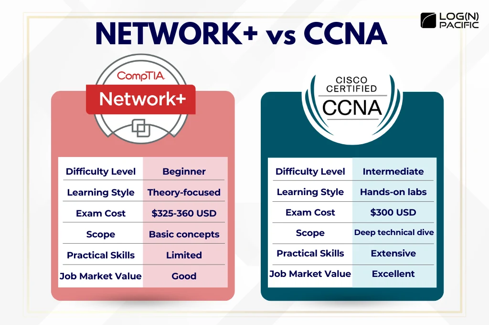
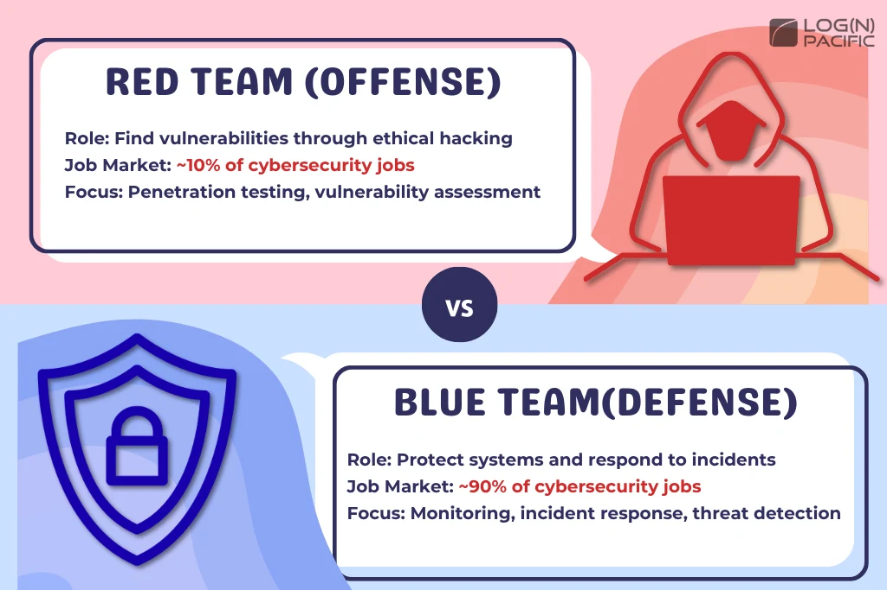
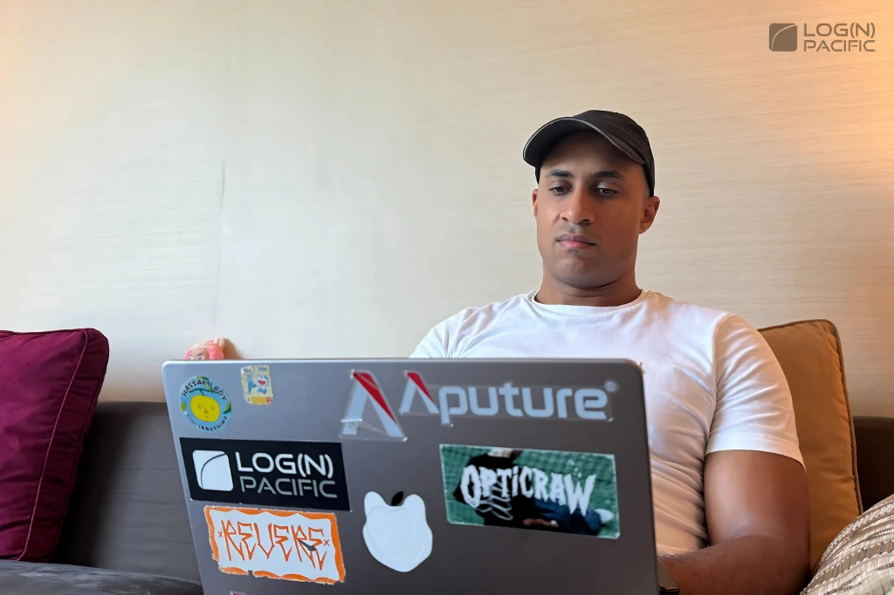

#### Table of Contents

## Struggling to Choose Your Cybersecurity Career Path?

There are so many career paths in cybersecurity that it's easy to get overwhelmed. Trust me, I've been there—stuck in analysis paralysis, wondering "which path is the right one?"

But here's the secret: **I never had a perfect plan**.

Starting from zero, I went from security engineer to program manager, then started my own company running a cyber range. If there's one thing I can say for sure, it's this: **execution and consistency beat a "perfect plan" every single time**.

In this article, I'm sharing the exact roadmap I'd follow if I were starting from scratch today. This is a step-by-step learning path that anyone can follow—even if you haven't decided on a specialty yet. It's designed to get you past that analysis paralysis and into action.

## Your Complete Cybersecurity Roadmap: 4 Foundation Steps + CISSP

The beauty of this roadmap? **Nothing you learn goes to waste**.

Every skill you pick up along the way applies across multiple security roles. Even if you're still figuring out what you want to specialize in, this path builds a solid foundation that makes pivoting easy when you're ready.

### Step 1: Build Your Security Foundation

First things first—you need to nail down the fundamentals of cybersecurity.

My top recommendation? The **Google Cybersecurity Professional Certificate**. It's affordable, widely recognized, and you can sign up directly on their official site. (Not an affiliate link—I just genuinely recommend it.) I have it myself, and so do tons of people breaking into the field.

#### Why the Google Cybersecurity Certificate Rocks

This cert covers basically everything CompTIA Security+ does, PLUS hands-on practical stuff:

- **SQL and Python** programming
- **SIEM (Security Information and Event Management)** tools
- Virtual labs where you actually do the work
- Broad coverage across different security topics

#### Got Some Extra Budget?

After finishing the Google cert, if you've got a bit more to spend, grab **CompTIA Security+** too.

Here's the play: completing the Google cert gets you a **discount voucher** for Security+. So getting both together actually costs less than buying Security+ alone (assuming you pass Google's exam on the first try and finish within 2 months).

Security+ runs about $425 USD. It's DoD 8140.03-M approved and meets ISO 17024 standards—meaning it's internationally recognized and carries serious weight.

**Free Resources:**

- [Professor Messer's CompTIA Security+ video series](https://www.youtube.com/@professormesser/search?query=Security%2B)
- [Our free Security+ practice exams](https://lognpacific.com/free-certification-practice-tests/free-security-sy0-701-practice-questions/)

  

**Key Point:** Everything at this foundation level applies to almost every security and IT job out there. No matter which path you choose later, this knowledge won't go to waste.

### Step 2: Learn Networking

Next up: networking skills.

Network knowledge is absolutely essential in cybersecurity. How attacks spread, where to place defenses—it all starts with understanding networks. Skip this and you'll struggle later.

Go for either **CompTIA Network+** or **CCNA (Cisco Certified Network Associate)**. You can study the material without taking the exam, but having the cert on your resume definitely helps.

#### Network+ vs CCNA: Which Should You Choose?

Let's be real—**CCNA is superior to Network+ in every measurable way**.

CCNA covers way more ground. You get hands-on labs, learn to actually build and configure networks, and understand switching at a deeper level. It's not just theory—you actually DO the work.

The catch? **CCNA is significantly harder** than Network+. The exam costs less, but you'll need way more study time.

#### My Take

If networking genuinely interests you and you're willing to put in the time, **go for CCNA**. The investment pays off.

If you just want the fundamentals and prefer a shorter path, stick with Network+.

**Free Resources:**

- [Professor Messer's Network+ videos](https://www.youtube.com/@professormesser/search?query=Network%2B)
- [Free Network+ Anki Flashcards](https://lognpacific.com/free-certification-practice-tests/free-comptia-network-n10-009-practice-questions/)

### Step 3: Get Into the Cloud

Step three is all about cloud platforms. I recommend starting with either **Azure (AZ-900)** or **AWS Cloud Practitioner**.

As of 2025, the **cloud market is worth $1 trillion and growing over 20% annually**.

Pretty much every business uses cloud platforms in some form. Mine definitely does. Every place I've worked has had some cloud infrastructure.

Bottom line: cloud skills aren't a "nice to have" anymore—**they're mandatory**.

#### AWS vs Azure: Which One?

Honestly? **Flip a coin if you're not sure**.

The core concepts are universal between platforms. Learn one, and picking up the other becomes way easier.

You don't even need the cert right away—just doing the coursework and labs gives you portfolio material. Sometimes you can snag free vouchers at events too.

### Step 4: Choose Your Specialty (Blue Team vs Red Team)

Once you've got the cloud basics down, it's time to specialize.

There are two main paths: **Blue Team (defense)** and **Red Team (offense)**. Sure, there's more to cybersecurity than these two, but if you're still figuring things out, these are your best bets.

#### Blue Team vs Red Team

About **90% of security jobs are defensive**, with offensive roles making up a much smaller slice.

But here's the thing: **studying offense makes you better at defense**. Understanding how attackers think makes you a way better defender. The reverse is true too, but I've found that offensive security really drives home why certain defensive practices matter.

**What's Your Move?**

If you're not sure yet, you've got options:

1. **Go full defense** - target roles like SOC analyst or security engineer
2. **Go full offense** - aim for pentester or red team positions
3. **Mix it up** - alternate between both paths until you find your groove

Try both and see what clicks. If you realize offensive security is your jam halfway through, pivot that direction. Nothing you learned gets wasted.

Let's break down both paths in detail.

#### Blue Team (Defense) Career Path

Defense is all about protecting systems and being the "guardian" of the organization. Lots of job opportunities and solid career stability.

##### Level 1: CompTIA CySA+ for Incident Response and Vulnerability Management

Learn the fundamentals of SOC (Security Operations Center) work—incident response, security operations, log analysis, SIEM tools, the whole deal.

**Free Resources:**

- [Our Free CySA+ practice exams](https://lognpacific.com/free-certification-practice-tests/free-comptia-cysa-practice-tests/)

##### Level 2: Blue Team Level 1 or Similar Hands-On Programs

This is where theory meets practice. Way more hands-on than CySA+.

**What you get:**

- Training with real-world security tools
- Practical SOC analyst skills
- Deeper security operations knowledge
- Real incident response practice

You're taking what you learned in CySA+ and actually applying it in realistic environments.

##### Level 3: Cyber Range for Real-World Experience

Even more practical than Level 2. Think of it as a training ground with the same security tools and tech stack you'd use on the job.

Many cyber ranges include internship components that you can list as actual work experience on your resume. Hiring managers want people who've actually done the work, not just studied it—and cyber range experience delivers exactly that.

#### Red Team (Offense) Career Path

Offensive security is about evaluating defenses from an attacker's perspective. Fewer jobs than blue team, but higher pay and specialized skills.

##### Level 1: CompTIA PenTest+ for Penetration Testing Basics

PenTest+ is your entry point into offensive security.

You'll learn the fundamentals of ethical hacking and penetration testing methodology. Tons of free study materials and practice exams available online.

**Free Resources:**

- [Our Free CompTIA Pentest+ Practice Exam](https://lognpacific.com/free-certification-practice-tests/free-comptia-pentest-pt0-002/)

##### Level 2: PNPT (TCM Security) or PTS (Hack The Box)

Both are highly practical and genuinely useful. You're not just learning theory—you're actually executing attack techniques.

Either choice is respected in the industry. Pick based on your learning style and budget.

**Which one fits you?**

- **Want business-ready report writing and structured learning?** → PNPT (TCM Security)
- **Want broad attack techniques and global community challenges?** → PTS (Hack The Box)

##### Level 3: OSCP (Offensive Security Certified Professional)

The industry standard for penetration testing and offensive security.

OSCP is brutal. I studied for it myself but never took the final exam—it's that demanding.

But here's what happened: **all those OSCP labs I completed gave me tons to talk about in interviews**. I landed my first cybersecurity job because of it.

### End Goal: CISSP Certification

Whether you go blue team or red team, **CISSP (Certified Information Systems Security Professional)** is your ultimate target.

CISSP is a career game-changer. Having it on your resume dramatically increases your interview rate and salary potential.

After I got mine, my interview rate shot way up. If you're serious about a security career, this should be your goal.

#### CISSP Requirements

The requirements sound strict, but they're more flexible than you'd think.

##### Work Experience Requirement

You need 5 years of full-time experience in 2 of the 8 CISSP domains. BUT—if you have a relevant degree or cert like Security+, that drops to just **4 years**.

IT work counts too (system design, operations, asset management, policy work). Most people can make their existing experience fit if they frame it right.

##### Endorsement Requirement

You need an endorsement from a CISSP holder. If you don't know anyone, ISC2 offers official endorsement support. And if you can't find someone, I'm a CISSP holder myself—feel free to reach out.

## Bonus: The WGU Degree Fast-Track

Tired of grinding through certs one by one? Check out **WGU's (Western Governors University) Cybersecurity and Information Assurance Bachelor's Degree**.

**Program highlights:**

- **NSA-certified** for serious credibility
- **Fully online** from anywhere in the world
- **Self-paced** (competency-based learning)
- **6 months to 1 year** to complete (if you hustle)
- Covers multiple certs from this roadmap (Security+, Network+, CySA+, etc.)

This program overlaps heavily with the roadmap I just laid out. Way more efficient than getting certs individually if you want both a degree and credentials.  
  
Related Video: [My Step-by-Step Strategy for Accelerating a WGU Degree](https://www.youtube.com/watch?v=BdEyx2GrDRg)

## My Real Career Story: Zero to Senior

Let me walk you through how my career actually went down. It wasn't perfect—but that's exactly why it's useful.

### **Level 1: Foundation Phase**

Started from absolute zero. No clue what I was doing.  
I just hammered through CompTIA A+, Network+, Security+, Project+, Server+, and studied Linux+ (didn't take that exam though).  
Covered the basics across all of IT. I had no idea what I wanted to specialize in, so I just learned everything.

### **Level 2: Deep Dive into Networking**

Got Network+, then pushed further with CCNA and even studied for CCNP Route.  
This networking foundation became crucial for my security work later on.

### **Level 3: Cloud Experiments**

Instead of chasing certs, I built tons of personal projects on Azure. Just messed around with cloud infrastructure constantly.

That practical experience got me hired at Microsoft. In interviews, I could say "here's exactly what I built on Azure"—and that carried way more weight than certs alone.  
Working at Microsoft gave me even more cloud exposure.

### **Level 4: The Security Pivot**

When I decided to go into cybersecurity, I completely skipped Blue Team and Red Team Levels 1-3. Looking back, probably not the most efficient move—but I didn't know better at the time.  
I jumped straight into CISSP and knocked it out. Then got the itch to become a "hacker," so I started studying OSCP.

All that effort plus my project portfolio landed me a role as Senior Information Security Analyst—for my FIRST security job. Yeah, senior title right out the gate.  
My existing IT experience, multiple certs, and projects made that possible.

The OSCP studying paid off big time in interviews. Understanding the attacker's mindset made me way better at defense. I could explain why certain security controls actually matter.

### What You Can Learn From This

My career wasn't some perfectly planned trajectory. It was messy trial and error.

But it worked because:

- I kept learning consistently
- I built real projects with my hands
- I could talk about concrete experience in interviews
- I didn't quit

**Execution and consistency beat a perfect plan.** My career proves it.

## Why This Roadmap Actually Works

Let me break down exactly why this approach is effective.

### Reason 1: Strong Foundation = Easy Pivots

Building skills in order from foundation to specialty gives you serious flexibility.

When you finally figure out "THIS is what I want to do," you've already got the base knowledge to move fast.

Examples:

- Networking foundation → easy transition to network security
- Cloud knowledge → quick ramp-up for cloud security roles
- Defense skills → easier to understand offensive techniques

If you're still figuring out your specialty, this roadmap lets you build career capital without risk.

Even in my own interviews, I could confidently say "I haven't used that exact tech, but I've got similar experience—I can learn it fast."

### Reason 2: Reverse-Engineered from "Getting Hired"

Learning skills isn't enough. You need to actually **get hired**.

That means:

- Presenting your skills and certs effectively on your resume
- Communicating your value clearly in interviews

This roadmap is designed backwards from that goal.

Every step gives you:

- Practical, hands-on experience
- Concrete certs and projects for your resume
- Real stories to tell in interviews

It's not just about knowledge—it's about building the kind of experience that makes hiring managers say "we want this person."

I've included templates for resumes, interview prep, and portfolio building—check the resources below.

## In Conclusion: Action Takers Win the Career

If you're frozen by "analysis paralysis," put the overthinking on hold and simply commit to this roadmap. With persistence and consistent effort, you will absolutely find your passion or get hired.

The vast majority of people give up. Therefore, if you refuse to quit and keep learning, **it is a mathematical guarantee that you will secure a job.** The outcome is a function of time and the effort you accumulate within it.

Follow this roadmap and do not quit. I'm cheering for you with all my heart!

### Free Resources to Support Your Journey

**[Cyber Community](https://www.skool.com/cyber-community/about) (Free)**

Everything you need from foundational learning to job prep—completely free:

Learning materials and practice exams

- Resume templates
- Portfolio building guides
- Interview preparation resources
- Active community for real conversations with peers on the same path

**Ready to Go All-In? Check Out [Cyber Range](https://www.skool.com/cyber-range/about?ref=df64395c5eb243e79ae1be7b3a40f59a)**

Beyond what Cyber Community offers, you'll get hands-on professional experience:

- Real workplace environment simulations for practical training
- Internship experience + employment verificatio
- Weekly live coaching sessions with Josh Madakor himself (ask questions directly)
- Access to real resumes from people who actually got hired

Tons of career-changers with zero experience have already landed tech jobs through Cyber Range.

If you're serious about breaking into the industry, Cyber Range is your move.
