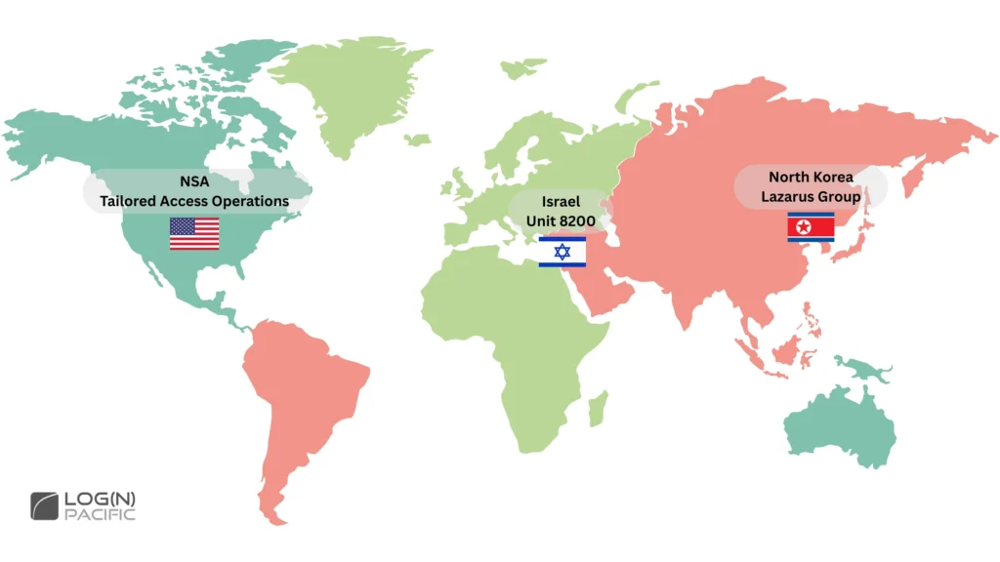
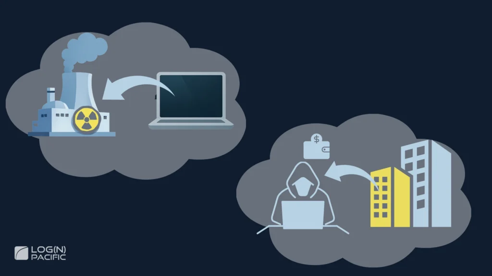
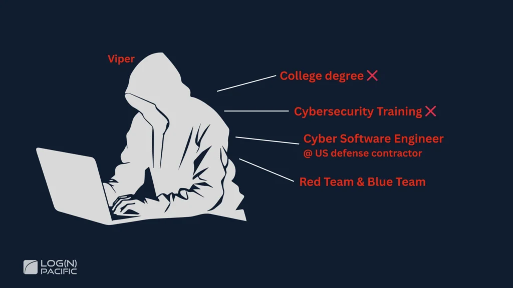
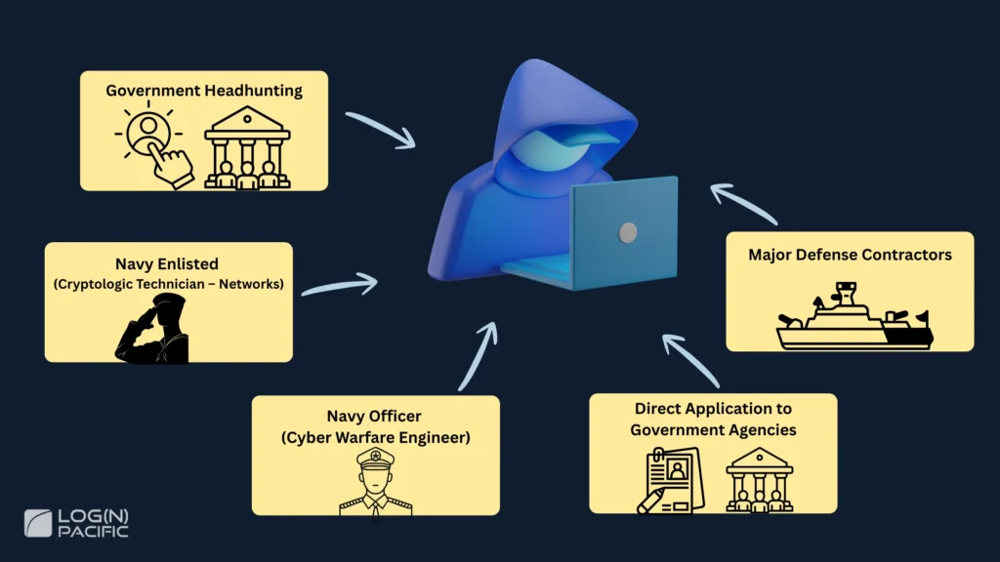

#### Table of Contents

The Hardest Job in Cybersecurity

Hey there! I'm Josh Madakor.

I've been working in cybersecurity for over 15 years—from Microsoft to government agencies, and now I'm passionate about hands-on cybersecurity education.

Through this YouTube channel and the Cyber Range community, my mission is to train the next generation of security professionals.

Today, I want to talk about what I consider the hardest—and coolest—job in cybersecurity: **Nation-State Cyber Operators**.

**What you'll learn in this article:**

- What Nation-State Cyber Operators actually do (with real examples)
- The reality of who works in this field (including someone hired by a major defense contractor without a degree)
- 5 concrete career paths (military, NSA, defense contractors, etc.)
- Salary ranges ($28,000–$200,000+)
- A free learning roadmap

## What Is a Nation-State Cyber Operator?

Nation-State Cyber Operators are elite cybersecurity professionals working on national-level missions for governments around the world.

Examples include:

- NSA's (National Security Agency) Tailored Access Operations (TAO)
- Israel's Unit 8200
- North Korea's Lazarus Group

## What Do Nation-State Cyber Operators Actually Do?

The work of Nation-State Cyber Operators is vastly different from typical cybersecurity roles.

In the past, there have been reports of operations that:

- Damaged a nuclear facility on the other side of the world using only a computer virus
- Stole $1.5 billion in cryptocurrency from a heavily fortified corporate network

At the NSA's TAO, true to its "Tailored" name, operations include:

- Maintaining and deploying zero-day exploits (attack methods for software vulnerabilities unknown to anyone else)
- Physically tapping undersea fiber optic cables to intercept communications when necessary

They customize operations to fit each mission's objectives and continuously refine their tactics until they achieve their goals.

## Who Actually Works as a Nation-State Cyber Operator?

Here's the thing: the people excelling in this field aren't necessarily "elites" or "geniuses."

Let me share a real case study to show you what this world actually looks for.

### Case Study: Landing a Top Defense Contractor Job Without a Degree

Someone in our group was hired as a Cyber Operator by one of the world's largest U.S. defense contractors.

He himself says:   
"I'm not a genius. I just think anyone can do it if they're truly open to accepting that it's not easy and it's not straightforward."

#### His Background

- No college degree (and no plans to get one anytime soon)
- Never formally studied cybersecurity
- Wanted to be a neurosurgeon as a kid

So what makes him special?

#### What Sets Him Apart

It's a **level of commitment where you "become the thing."**

This isn't "I'll study two hours after work and hopefully land a job at the NSA someday." We're talking about people who live and breathe this from the moment they wake up until they go to sleep.

#### His Daily Approach

Here are some concrete examples he shared:

- **When using exploits**: He references Exploit DB (a database of known vulnerability exploit code), then spends 1–2 hours—or even 1–2 days—completely rewriting it for his own use
- **Tools he uses**: Everything runs from PowerShell or command line. He's at the level where "I can write shellcode with just a text editor"
- **Adaptability**: "Give me any programming language, any editor, and I can make something work"

#### Natural Curiosity

Here's a story from when he was in 6th grade that really captures who he is.

When a friend got locked out of his house, he said "I know how to pick locks" and proceeded to use a metal clip from a pen and a paper clip from homework to actually pick the lock right there.

His curiosity extends far beyond code and software.

He completely disassembles his motorcycles and cars, figures out all the electronics and wiring, and then reassembles them.

He doesn't "put on a hacker hat"—**he just finds himself doing it**. That's his essence.

## The Mindset Required for Nation-State Cyber Operations

What we learn from Viper's story is that mindset matters even more than technical skills.

### Wrong Mindset vs. Right Mindset

He points out that many people approach this with the wrong mindset.

**❌ Wrong Mindset:**

"Just give me A, B, and C, and I can be like you, right?"

**✅ Right Mindset:**

- Small incremental trial and error
- When something doesn't work, ask "why did it fail?"
- When something does work, understand "why it worked"
- Accept that years later, you'll realize "the reason I thought it worked was completely different"

"Making something work" and "understanding why it works" are **completely different things**.

### The Most Critical Skill: Self-Awareness

Another crucial point Viper emphasized: **accurately knowing where you currently stand**.

**A Real Example:**

Someone (with Business Analyst experience) self-assessed their Python skills as **"8 out of 10."**

Viper said, "No, I think you're a 2."

**When asked simple questions:**

- "Explain list comprehension" → "I don't know"
- "How do you manage context?" → Couldn't answer

After the conversation, the person admitted: "After talking with you, I realize I'm a zero."

#### Viper's Message

"Not knowing something is totally fine. But lying to yourself? That's not okay."

He continues:

"Don't lie to yourself. Don't lie to me. He should have known he was at level 2. When you inflate your self-assessment, you become blind to the fact that there's so much you don't know."

### If You're Aiming for This Career

1. **Be honest in self-assessment**: Have the courage to admit what you don't know
2. **Stay humble**: Understand there's always more to learn
3. **Set realistic goals**: Knowing where you are reveals your next steps

And remember this:  
**"To just get a job, you don't need to be super high-level. I mean, I got my job,"** Viper says.

You don't need to be perfect. You just need to know where you are and have the resolve to move forward from there.

## How to Become a Nation-State Cyber Operator

There are several routes to becoming a Nation-State Cyber Operator. Each has different barriers to entry and required skill levels, so choose the path that fits you best.

### The 5 Main Routes

Broadly speaking, here are five ways in:

1. **Get headhunted by a government agency**: Build skills naturally until the government comes to you
2. **Enlist in the military**: Relatively lower barrier to entry
3. **Commission as a military officer**: Significantly higher barrier
4. **Apply directly to government agencies**: Target GS (General Schedule) civil service positions like at the NSA
5. **Work for major defense contractors**: Lockheed Martin, Raytheon, Booz Allen, etc.

### Route 1: Government Headhunting

Like Viper, if you build skills on your own, you might get contacted by the government one day.

**What you need:**

- Commitment at a level where you "become the thing"
- Deep understanding of operating systems
- Proficiency with low-level languages like C
- Thousands of hours of practice

If you reach this level, opportunities will naturally arise. However, getting there is extremely difficult.

### Route 2: Navy Enlisted (CTN) - Lower Barrier

The relatively more accessible route is the Navy's CTN (Cryptologic Technician – Networks) position.

#### Enlistment Process

1. Take the ASVAB (military aptitude test)
2. If your score is high enough, you can get CTN (if positions are available)
3. Complete MEPS (Medical Processing)
4. Attend Boot Camp
5. Progress to JCAC (Joint Cyber Analysis Course): About 6 months in Pensacola, Florida

#### The ION Program - Path to Elite Status

If you perform exceptionally well at JCAC, you can apply to—or be selected for—a special program called ION.

**What is ION?**

- An elite program within CTN
- Actually conducts Offensive Cyber Operations
- High probability of working closely with teams like the NSA and Tailored Access Operations

#### Pre-Enlistment Preparation Is Critical

If you're targeting ION, you should already be at a fairly high level before entering CTN.

**Helpful to have:**

- Offensive Security skills (at least intermediate level)
- A college degree
- Certifications like OSCP (Offensive Security Certified Professional)

#### What If You Don't Make It?

- If you fail JCAC: You might be reassigned to another Navy role (like cook)
- If you're not selected for ION: You work as a regular CTN (which is still a pretty cool job)
- You can probably reapply to ION later

### Route 3: Navy Officer (Cyber Warfare Engineer) - Extremely Difficult

The Navy has a position called "Cyber Warfare Engineer." This route has a very high barrier to entry.

#### Required Skill Level

Just to apply, you need to already be at this level:

- Skilled corporate software engineer level
- Proficient in low-level programming languages like C
- Strong in Cyber Operations and Offensive Security
- Basically: a top-tier software engineer + top-tier pentester combined (not averaged)

#### Selection Process

**Technical Screener:**

- CTF (Capture The Flag) style challenge
- Must be able to write C code fluently
- Binary Exploit Development
- Reverse engineering compiled binaries
- These alone require 1,000+ hours of serious study

**Technical Interview:**

- Similar to corporate coding interviews
- LeetCode-style problems in C
- Data Structures & Algorithms
- Reverse Engineering various Exploit Techniques
- Computer Science fundamentals (Networks, OS, etc.)

#### Training Period

If you're selected, you'll undergo 2–3 years of specialized training. During this time, you won't go on actual missions. By the end, you'll have reached a very high skill level.

#### The Reality of How Hard This Is

Even though I'm good at studying, Binary Exploitation and Reverse Engineering aren't something you can just casually sit down and start working on.

You have to spin up debuggers, set up your environment, and finally get into flow state. If you get interrupted, your concentration shatters—that's how demanding this work is.

### Route 4: Direct Application to Government Agencies

You can also apply directly to government agencies like the NSA. In this case, you're targeting GS (General Schedule) civil service positions.

**Required Level:** You need to already be at Viper's level. In other words, you need to be really, really good or acceptance is unlikely.

I seriously considered applying to the NSA myself and actually flew to Maryland to check out Fort Meade before applying. But ultimately, I decided my skill level wasn't quite there yet.

### Route 5: Major Defense Contractors

You can also apply to major companies like Lockheed Martin, Raytheon, and Booz Allen.

**Required Level:** You need to be at Viper's level for this too. However, if you reach that level, you'll probably get hired somewhere because so few people actually make it there.

But if you become that person, you're basically unicorn status.

It's an incredibly difficult path, but if you get there and apply, the competition itself isn't that fierce.

## What Do Nation-State Cyber Operators Make?

We've covered various routes—so what's the actual pay?

Salary ranges vary widely by route. For military and government positions, you need to consider not just base pay but also various allowances and benefits.

Let's look at the salary ranges for each position. These figures are based on publicly available information.

### Navy Cryptologic Technician – Networks (Enlisted)

- Annual salary: $28,000–$47,000
- Determined by Enlisted Rank
- Usually start at E1 if enlisting with nothing
- Can start at E3 or E4 with a Degree or Certifications

**Actual Value:**The numbers might not look impressive, but

- Housing and food costs are almost entirely covered
- You get training like JCAC that's normally unavailable
- If selected for ION, you receive training that money literally can't buy
- Housing Allowance is provided if living off base
- Hazard Pay and Hardship Pay for dangerous assignments

### Navy Cyber Warfare Engineer (Officer)

- Annual salary: $43,000–$110,000
- Base pay plus Housing Allowance and other benefits
- When you factor in benefits and training value, actual worth is much higher

### NSA (Government Employee)

- Annual salary: $50,000–nearly $200,000
- Entry level around $50,000
- Upper levels near $200,000
- Varies greatly depending on what grade you enter at and what qualifications/experience you have

### Defense Contractor (Cyber Operator)

- Not direct government employment—work for the government through contractors
- Often requires Top Secret Security Clearance (highest level)
- This clearance itself significantly increases your market value

### Bonus: Another Option - The Dark Market

Here's something interesting: if you reach the level where you can discover zero-days yourself, there's a Dark Market for zero-day exploits.

#### Responsible Disclosure Route

- Report to the Government or vendors like Apple
- NSA: You get a "well done"
- Apple: Bug bounty of around $20,000

#### Dark Market Route

- For Remote Code Execution vulnerabilities in Samsung or iPhone devices
- Six figures ($100,000s) to high six figures
- Sometimes even **seven figures ($1 million+)**

Many people at this level aren't working for governments, or they're working for other governments doing gray-to-black operations, or they're simply operating as Black Hat Hackers.

Why? Because economically, it's more lucrative than playing by the rules as a White Hat or Gray Hat.

## Take Your First Step

We've taken a deep dive into the world of Nation-State Cyber Operators.

Remember Viper's words:

"Anyone can potentially do it. But whether you're willing to change your mindset—that's what separates people."

And crucially:

"To just get a job, you don't need to be super high-level."

You don't need to be perfect. You just need to know where you are and have the resolve to move forward from there.

Which route you choose depends on your current skill level, education, and how committed you're willing to be.

- **Lower barrier**: Navy CTN → JCAC → ION
- **Extremely difficult but direct**: Navy Cyber Warfare Engineer, direct NSA application, Defense Contractor
- **Organic**: Build skills and get headhunted by the government

All these routes require "thousands of hours of serious commitment." But if you get there, possibilities open up.

## Next Steps: Learning Roadmap

For those ready to start learning Binary Exploit Development and X86 Assembly, I've compiled a complete roadmap with resources I personally found valuable.

▶︎**View the [Learning Roadmap](https://docs.google.com/spreadsheets/d/1TYxB0l6BE10RV2IupRUb2uKNj1tcagmPKMHwvIJsgsk/edit?gid=383407471#gid=383407471)**   
  
**This roadmap includes:**

- ✅ Required study hours and costs (specified per task)
- ✅ Recommended resources (Darknet Diaries, OpenSecurityTraining2, AlgoExpert, etc.)
- ✅ Technical skill acquisition sequence (Exploit Dev, Reverse Engineering, Programming)
- ✅ Concrete career path steps (Navy CTN/ION, obtaining Clearance)
- ✅ Mindset and community (mental approach for staying consistent)

Also, in the free "Cyber Community," we've posted resume templates—feel free to use those too!

No matter where you currently are, there's a next step for you.

**Start today.**

**Related Articles**

- - [From Zero to 500k Dollar Cybersecurity Careers: The Real Roadmap](https://joshmadakor.tech/blog/5448/)
  - [Top Cybersecurity Skills You Must Learn Before 2030 [Ultimate Guide]](https://joshmadakor.tech/blog/5503/)
