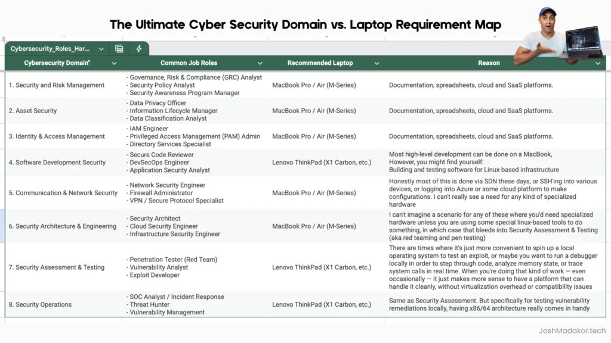

#### Table of Contents

Let’s be real: most people think that to get into cyber security, you need to be a "super elite hacker" running 10 different virtual machines on a glowing, heavy-duty gaming laptop.

**Spoiler alert: That’s just not how the industry works.**

I’ve spent years in roles ranging from Senior Analyst to Security Engineer, and I’m currently architecting a cloud-based Cyber Range from scratch. The truth is, your **specific job domain** should dictate the tech you use—not some stereotype you saw in a movie.

Stop over-analyzing specs and start focusing on execution. Here is my "No-Fluff" guide to choosing your weapon for 2026.

## 1. The "Magic" of Reliability: Why I Switched to Mac

I’ve used every Windows x86 laptop under the sun. But the moment I opened an **M-series MacBook Air**, I felt the magic. It just works. Every time.

- **Predictability:** No more failed Windows updates mid-project.
- **Battery Life:** I can work all day without hunting for an outlet.
- **Stability:** When you're building complex cloud architectures, you need a stable terminal, not a jet engine fan.

 
I haven't touched a physical Windows machine in four years. My entire team—from backend engineers to content creators—runs on MacBooks. We run a highly profitable business on these machines.
> **Josh's Reality Check:** If your job is browser-based—like 80% of security roles today—don't get bogged down in hardware specs. That mental energy is much better spent actually building your labs and portfolio.

## 2. The Domain Map: What Do You Actually Need?

I built a spreadsheet to settle this debate. Not every role requires specialized hardware.

 

Spreadsheet：[The Ultimate Cyber Security Domain vs. Laptop Requirement Map](https://www.youtube.com/redirect?event=video_description&redir_token=QUFFLUhqa3lCLTZmc0dYckRoNGZzV0drVExtUTdNTFNiUXxBQ3Jtc0tsTHpNRWw4XzgxSkNIYVpwNmpJMFBQY25FZ05RdTRrWXhWZnpNaG9tUmpqeXNxM0pXYVNEMzBoV1UxVzFxZVd1UmtDMndEX0d0MV8zNnd4NDRkbk84SnlEeTE1WXl1T3BlTFNDNUIyQm05OFlCUks4aw&q=https%3A%2F%2Fdocs.google.com%2Fspreadsheets%2Fd%2F1B-HcbQXkgIEEA-LHUtJRl0_iR9FBwvKz6WYf-XVsHw8%2Fedit%3Fusp%3Dsharing&v=IywA8E4cqYY)

### GRC, IAM, and Soft Analyst Roles

If you are in Governance, Risk, and Compliance (GRC) or Identity and Access Management (IAM), you are living in the browser.

- **Recommendation:** **MacBook Air (M1, M2, or M3/M4)**.
- **Why:** You need portability and reliability. Any "potato" laptop can do this job, but a Mac makes it pleasant.

### Security Architecture & Engineering

You’re designing systems, writing Python, or querying KQL in Azure.

- **Recommendation:** **MacBook Pro or Air (16GB+ RAM)**.
- **Why:** People say "you can't do engineering on a Mac." Tell that to my production environment. If you need a Windows environment, spin up a VM in the cloud. It’s better practice anyway.

### Red Teaming & Penetration Testing

This is the only area where I might pivot.

- **Recommendation:** **Lenovo ThinkPad (X1 Carbon or T14)**.
- **Why:** If you need to do heavy local debugging, run Kali Linux natively, or perform specialized x86 exploits, a Windows/Linux native environment is more convenient.

## 3. Addressing the "Compatibility" Elephant

One of the most common questions I get is: *"But Josh, what about x86 tools that don't run on ARM M-series chips?"*

Listen, if you're a student or a pro, you should be moving toward the **Cloud**.

1. **Stop running everything locally.** It's 2026. Real enterprise security happens in the cloud.
2. Use **Azure, AWS, or a Cloud-based Lab**.
3. If you absolutely must run a local VM on a Mac, use **UTM** or **Parallels**.

If you find a tool that *only* runs on x86 and you can't find a cloud workaround, then fine—get a ThinkPad. But do NOT let "compatibility" be the reason you haven't started your first project.

## 4. The Budget Strategy: Beating the "Catch-22"

If you’re stuck in the "No Job = No Money = No Laptop" cycle, listen closely: **You do not need a $2,000 machine to get hired.**

- **The Refurbished King:** Buy a **refurbished Lenovo ThinkPad T480** on eBay.
- **The Price:** Under $300.
- **The Power:** It’s a workhorse. Upgrade the RAM, install Linux, and it will take you through every certification and lab you need.

**Excuses end here. Pick a machine and start building.**

## Final Verdict

Your laptop will **not** limit your career. Your **execution** will.

I’ve built a career and a business on a MacBook Air.   
Pick a machine, stop looking at benchmarks, and start building your portfolio today.

### Ready to Build Real Experience?

If you’re serious about breaking into IT, you need more than just a laptop—you need a track record. **The Cyber Range** is the fastest way to get resumé-backed, enterprise-level experience for a fraction of the cost of a bootcamp.
**Everything you need to get hired:**

- **Verified Work Experience:** A guaranteed, resumé-backed internship to break the "Catch-22."
- **Real Enterprise Tools:** Hands-on access to **Tenable, Microsoft Sentinel, and Defender.**
- **Weekly Live Coaching:** Direct access to me and my team for feedback and guidance.
- **Career Toolkit:** Practice exams, Interview prep, and our winning Resumé/Portfolio templates.

Don't just study for the job. Start doing the work.
**[[Join the Cyber Range]](https://www.skool.com/cyber-range/about)**

## Q&A: Top Questions Answered

Q: Are M-series Macs really compatible with all security tools?

A: 99% of what you’ll do is cloud-based or browser-based. For the rest, Parallels or UTM handles it. If you’re that 1% doing low-level exploit dev on x86, you’d already know you need a ThinkPad. For everyone else, Mac is the king of stability.

Q: Should I get 16GB or 32GB of RAM?

A: 16GB is the baseline for 2026. Don’t go lower. 32GB is only necessary if you’re too stubborn to use the cloud and insist on running a massive local lab. Save your money and put it toward cloud credits instead.

Q: I’m worried about Lenovo's security reputation. What should I do?

A: Wipe the drive and do a clean OS install. Problem solved. If you’re still paranoid, get a Dell Latitude, but you’ll pay more for the same performance.

Q: Is a GPU necessary for Cyber Security?

A: No. Unless you are cracking hashes all day (which you should do in the cloud) or doing heavy AI research, a GPU is a waste of money for a beginner.

A: 99% of what you'll do is cloud-based or browser-based. For the rest, Parallels or UTM handles it. If you're that 1% doing low-level exploit dev on x86, you'd already know you need a ThinkPad. For everyone else, Mac is the king of stability.

A: 16GB is the baseline for 2026. Don't go lower. 32GB is only necessary if you're too stubborn to use the cloud and insist on running a massive local lab. Save your money and put it toward cloud credits instead.

A: Wipe the drive and do a clean OS install. Problem solved. If you’re still paranoid, get a Dell Latitude, but you'll pay more for the same performance.

A: No. Unless you are cracking hashes all day (which you should do in the cloud) or doing heavy AI research, a GPU is a waste of money for a beginner.
