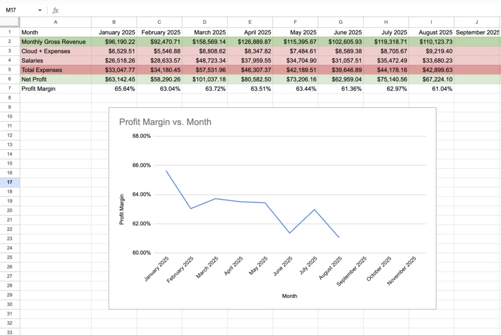
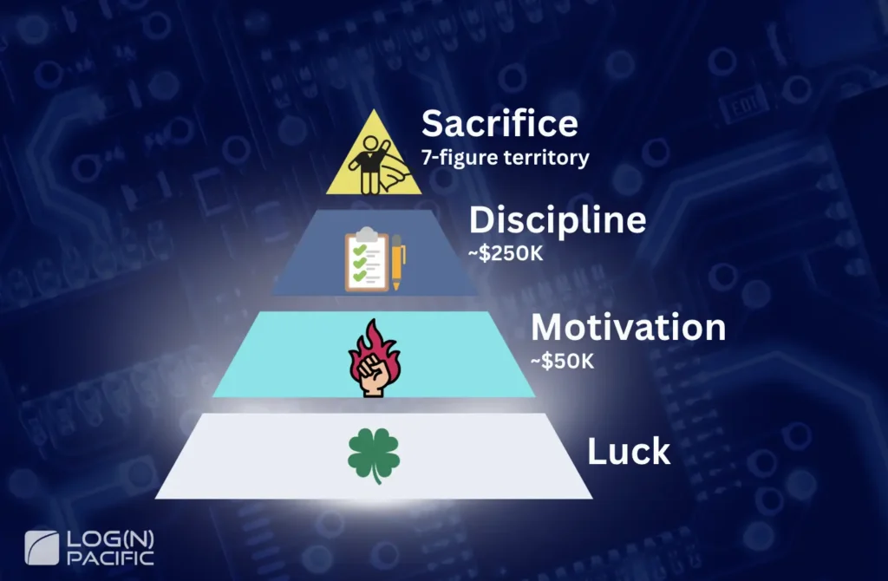
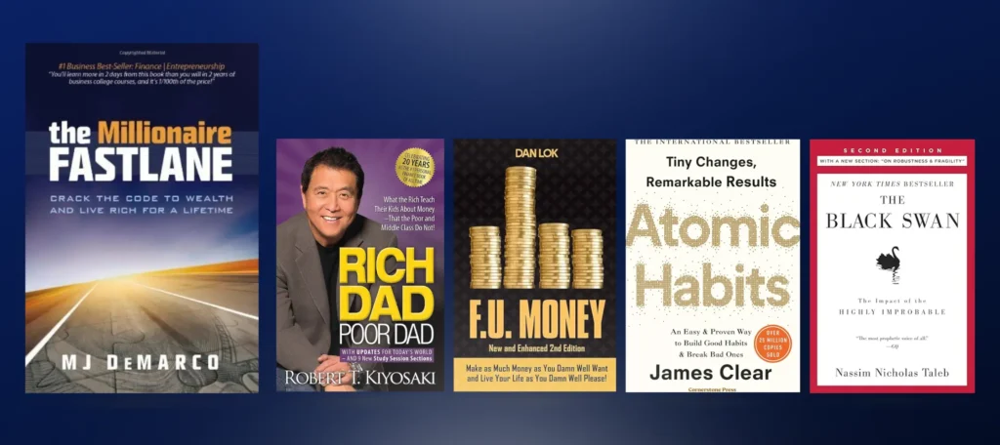
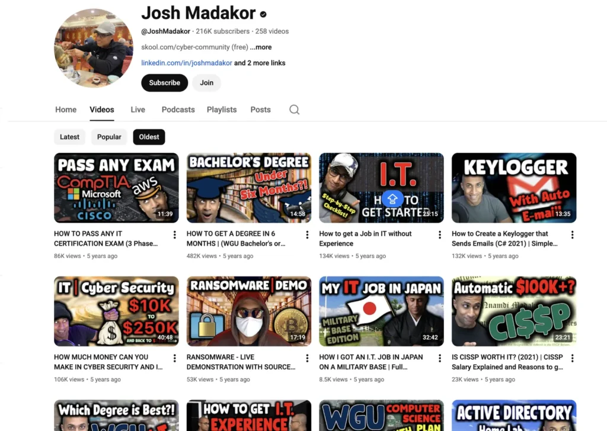
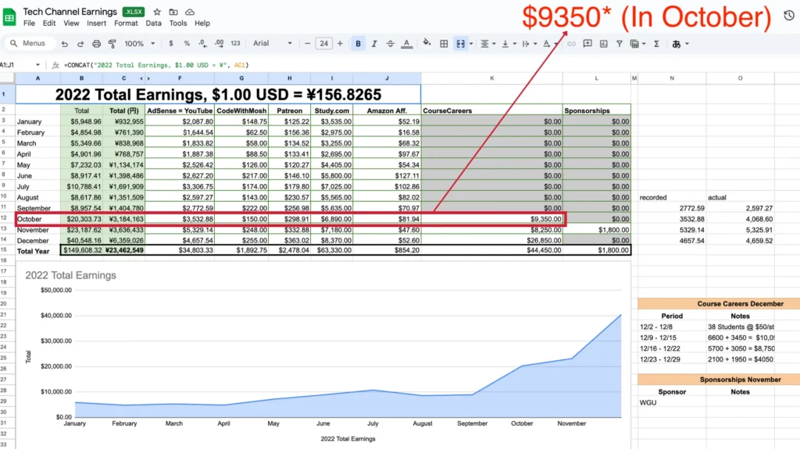
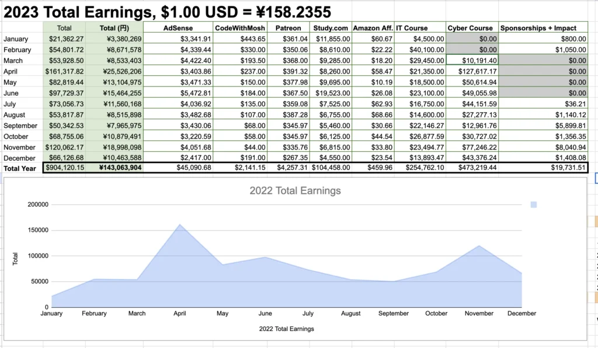

#### Table of Contents

If you're stuck at $50K–$100K and wondering, "How the hell do people make seven figures?" this is for you.  
I'm Josh Madakor. In 2025, I made **$1.3 million** in cybersecurity. Not from a corporate job. Not from VC funding. And definitely not from selling a bullshit course.  
In this article, I'll break down **everything**: my exact revenue sources, the mistakes I made, the sacrifices I didn't expect, and the 3-phase roadmap you can follow.  
**No fluff. No politician answers.** Let's go.

## Full Revenue Disclosure: $1.3M Breakdown & Profit Margins

### 2025 Total Revenue: $1.3M+

Here's where every dollar came from:

- **Cyber Range**: ~$100K/month average (**$1.2M+ annual**)
- **Cybersecurity Course** (legacy sales): **~$100K**
- **IT Course** (legacy sales): Ongoing revenue
- **Other revenue streams** (AdSense, consulting, etc.)

I'm showing you this first because **transparency builds trust**. A lot of people in this space hide their numbers or inflate them. I don't play that game.

### Profit Margin Reality Check

Let's talk honestly about how much I actually **keep** after expenses.  
If I were a ruthless businessman who optimized everything, I could run this at **85–90% profit margins**.

That's $1.17M + of the $1.3M in my pocket. But I don't.  
My actual profit margin is around **60%**. Why?

- I pay my staff generous bonuses
- I keep team members long-term (not disposable hires)
- I invest in long-term infrastructure, not short-term wins

Here's my actual expense breakdown as of August 2025:

 
**Bottom line**: I keep about $780K after expenses. Still life-changing money, but I want you to know the real numbers.

## The Four Ways to Make Money: From Luck to Sacrifice

### Level 1: Luck (Uncontrollable)

Were you born into a wealthy family? Middle class? Or in poverty?  
Here's the truth: you didn't choose this. I didn't choose my starting point either. Nobody did.

You can't control where you started. But you can control where you go from here. So acknowledge it, accept it, and move on.

### Level 2: Motivation (~$50K)

This is working only when you feel like it.
You work when motivated. You push when inspired.
The shift to $250K? It's learning to work even when you don't want to.

### Level 3: Discipline (~$250K)

This is working even when you don't want to.
Corporate grind can get you here. Hard work. Consistency. Following through.
You can make decent money with discipline.

### Level 4: Sacrifice (7-Figure Territory)

This is where shit gets real. People don't realize this until they get here (I didn't either), but to make seven figures, **you will sacrifice something**. And I don't mean you gave up eating Twinkies or watching Netflix.

**Real sacrifice means**:

- Your 20-year childhood friend disappears
- You break up with your girlfriend/boyfriend
- You lose contact with certain family members (maybe even your parents)

**Why does this happen?**

If you grow up with people making $40K and working at Target, and you start making $150K, **you'll lose friends**. If all your friends make $40K and you pull in $1.5 million? **They'll look at you like you're Jeff Bezos.** They won't know how to interact with you. There will be weird expectations. Energy drains. Resentment.

It's not their fault. It's not your fault. It just **happens**. You can try to bring people with you on the journey. But you can't force them. **Just be prepared**: You will likely lose somebody along the way.

 

## How I Got Here: From Employee to Entrepreneur

#### 2007–2022: The Corporate Grind

Let me tell you about my technical background so you know I'm not some lucky rich kid who lucked into success. From **2007 to 2023**, I had normal IT and cybersecurity jobs. Nothing glamorous. Just steady work.

Over those 14 years, I accumulated:

- **3 degrees**: Bachelor's in IT, Bachelor's in Computer Science, Master's in Cybersecurity
- **14 certifications** (most expired now—I only maintain CISSP so I can endorse people in my community)
- Senior-level roles in IT and cybersecurity
- Final job: **Software Engineer at Microsoft, $180K/year**

### 2022: The Turning Point & Preparation

#### The Turning Point: The Rule I Made

Around 2022, something started pissing me off.  Objectively, I was working harder than people around me—more certifications, more studying, more output. But I couldn't make more money or create real impact. Coworkers literally blocked my work.

If you've worked corporate, you know how draining that is.  
So I made a hard rule:

> **"This current job will be my last 'normal job.' After this, I have to do entrepreneurship in some form. I have to have my own business."**

I didn't know what I'd do. But I forced that rule on myself.

If you want to make serious money, I think it's important to commit, save up a cushion, and burn the bridge mentally of working a normal corporate job.

It's important to do this mentally.

By eliminating other options, you force yourself into a position where you have to succeed.  
For me at the time, that was really important.

#### Preparation Phase: Reading Business Books & Experimenting

Again, at that time, I didn't know how to make big money. I knew I had to do business in some way, but I didn't understand what I should do.  
So I read a ton of books:

- *The Millionaire Fastlane* (really good)
- *Rich Dad Poor Dad*
- *F.U. Money* by Dan Lok
- *Atomic Habits*
- *The Black Swan*

 

Some were really good. Some were kind of cringe. But I was trying to understand the pattern of how people actually make money.

I also **experimented**. I built apps. I built websites. Most of them were kinda shit. I could have made money with some of these projects, but as I worked on them, I realized "**I don't want to spend time and energy on things that can easily be destroyed**."    
And then it hit me.

I looked back at my career and realized "**I'm abnormally good at helping people get IT jobs**."  
Over my 14 years of job-hopping (ADHD, easily bored, whatever), I became **really good** at:

- Finding jobs
- Interviewing
- Negotiating offers

And whenever I helped friends in my personal circle, they had **very high success rates** landing decent-paying jobs.

So I thought, "What if I scaled this?"

One thing I learned from *The Millionaire Fastlane*: one way to make big money is to **take something valuable and scale it massively.** That's when I started the YouTube channel.

#### YouTube Launch + Free Consulting Days

I launched a YouTube channel teaching people how to get IT and cybersecurity jobs. I didn't know exactly how I'd make money. I knew about AdSense. I saw other creators doing sponsorships and integrations. But I wasn't sure.So I just made the channel anyway.

I bought a course from another YouTuber on how to do YouTube properly. I got a camera. I put in **massive effort**. My channel didn't "blow up." It just grew steadily, linearly. I'm at around 210K subscribers now.

 

My channel is still up—all 5 years of it. You can watch the evolution from "guy with a camera" to "guy with a slightly better camera and lighting." Progress.,

But here's what **actually happened**: I got **massive engagement**. People started asking questions in the comments. At first, I answered every single question. Not bullshit one-word answers like "Great!" or "Do this." I did **full-blown career consulting in the comment section**.
And people noticed. They asked more questions. I answered more. It created a feedback loop. And I hit what I call **critical mass**.

### Late 2022–Early 2023: First Monetization

#### Critical Mass: The Breaking Point = Time to Charge

At some point, I physically couldn't answer all the questions anymore. This is actually a good sign—it means you can start selling something. When demand exceeds your free capacity, that's your green light.

I started with **Patreon**. People donated and asked questions on Discord. Made a little money, not much. Then I tried **$200/hour consulting slots**. Released 10 slots. They sold out immediately. "Okay, this is something," I thought.

I met with all 10 people. Honestly? I was completely drained. I'm not the most social person. I love talking to my audience—I'm grateful for it. But 10 hours of consulting for $2,000 takes massive energy. Even if I scaled to 1,000 hours a year, that's only $200K–$300K. Decent, but not much more than corporate (I had two jobs then, making $250K). Plus, these became therapy sessions. People talked about personal issues, not just IT or cybersecurity. I realized: **This is not scalable.** So I pivoted to an info product.

#### First Monetization: IT Course → $10K Month One

I looked at everything people were asking me in the meetings:

- How to get a job
- What to study
- How to build a resume
- Interview prep

I packaged all of that into an **IT course** that taught people how to land entry-level IT jobs.
Around this time, I met another YouTuber who introduced me to the CEO of Course Careers. They offered to let me build a course under their brand. I agreed. Why?

- If they sold it (even without my effort), I'd get a cut
- If I sold it with my link, I'd get a bigger cut
- I still didn't know what I was doing, so this felt safer

The course launched at the end of 2022 for **$500**.
**First-month revenue**: $10,000

I didn't even market it aggressively. The demand was already there. When I saw that $10K roll in while still working as a software engineer at Microsoft, I thought: **"If I quit my job and put that energy into entrepreneurship, I could make way more money."**
So I did.
 

### 2023: The Scaling Year

#### Quitting Microsoft & Launching Cyber Security Course

**April 2023**: I quit Microsoft.  
**May 2023**: I launched the **Cybersecurity Course**.  
My IT course people—and my YouTube audience—kept asking for a cybersecurity version. They were asking for a **specific product by name** before it even existed. This is called **buying pressure**. When people are asking you for a specific product, that's your signal to build it.

The Cybersecurity Course taught people to:

- Build their own Security Operations Center (SOC)
- Get attacked by real malicious actors on the internet
- Perform incident response

It was **really good**. I put a ton of time into it.

#### Annual Revenue: ~$900K Achieved

Here's how it performed:

- **IT Course (full year 2023)**: $254,762.10
- **Cybersecurity Course (10 months in 2023)**: $473,219.44

**Total 2023 revenue**: ~$900K (including 4 months of Microsoft salary)

 

### 2024: The Platform Pivot

#### Recognizing the Course Market Problem

By mid-2024, I started noticing a problem.

**Course stigma** was growing. Shitty YouTubers were making low-quality courses and spending 80% of their energy on marketing instead of product quality.

People got scammed. They blamed the scammers (rightfully). But it created a negative perception around **all** courses, including good ones.  
Also, competitors were trying to **steal and replicate** my content.

So I asked myself: **"What can I build that people can't copy or criticize?"**

#### Strategic Decision: Intentional Sales Suppression

That's when I decided to build **Cyber Range**.

**Strategic Decision**: While building Cyber Range, I put a big notice on my existing Cybersecurity Course landing page:

> "Wait for the new platform (Cyber Range). It's coming soon."

This impacted sales:

- 2023 Cyber Course revenue: $430K
- 2024 Cyber Course revenue: $284K

**But this was intentional.**  
I was investing in long-term infrastructure, not short-term sales. I was building a "moat" that couldn't be copied.  
This decision proved to be the right one.

#### Building Cyber Range

I started building something completely different from a traditional course—a full enterprise environment that would be nearly impossible to replicate.

### 2025: $1.3M Realized

#### What is Cyber Range?

Imagine getting hired at a company. You get issued credentials for all the enterprise tools you'll use. You might get training.  
That's Cyber Range—but **better**.  
I built a real corporate work environment on **Microsoft Azure**:

- **Tenable Vulnerability Management** (enterprise license, ~$5K for 100 users)
- **Microsoft Defender for Endpoint**
- **Microsoft Sentinel** (SIEM)
- Automated onboarding system
- Multiple courses built inside (onboarding, vulnerability management, security operations, threat hunting)

When students join, they get **all** the credentials. They share the same environment with hundreds of other students, creating:

- Organic traffic
- Organic attack patterns
- Real-world noise (just like work)

It's **literally like being at work**—but with deliberate training.  
I priced it at **$97/month**. Which is ridiculously cheap for what you get.

By 2025, here's what happened:

- **Cyber Range revenue**: ~$100K/month average
- **Current membership**: 1,200 people (less than 1% of my 210K YouTube subscribers)
- **Total 2025 revenue**: $1.3M

By **September 2025**, I crossed **$1 million** for the year.

#### School.com Win & 100+ Job Placements

I also randomly won the **School.com Q1 2025 Games**. My community grew more than any other community on the platform.  
I got flown out to California to hang out with Sam Ovens (CEO of School) and speak at an entrepreneur event.  
In 2025, I issued **100+ offer letters** to members who landed cybersecurity jobs.

**2024 Cybersecurity Course revenue** (with a big warning on the landing page about the upcoming Cyber Range): $284K  
Most of my 2025 revenue came from Cyber Range.

## 3-Phase Roadmap (How You Can Do This)

Here's the thing: **Don't copy my tactics. Copy my thinking.**
You don't need to make a YouTube channel about cybersecurity. You don't need to build a SOC on Azure.
You need to understand the **pattern**.

### Phase 1 - Build Skills & Identify Your Strengths

#### Step 1: Master Something Valuable

My strength was the combination of 14 years of IT/cybersecurity experience and an abnormal talent for helping people get jobs.

**Your strength**: What do people repeatedly ask you for help with?Think about it. What are you abnormally good at? What do friends or coworkers come to you for?  
That's your signal.

#### Step 2: Test at Small Scale

Before I started YouTube, I helped 5–10 friends get jobs. I tracked the results. The success rate was high.

**Your version**: Help 5–10 people for free. Record the results. If you're consistently successful, you've found something valuable.

#### Step 3: Create Content as a Byproduct

Start documenting your process. YouTube, blog, LinkedIn—pick one.
**Don't aim for virality. Aim for usefulness.**
My channel didn't go viral. It just grew steadily because I provided real value.

### Phase 2 - Reach Critical Mass

#### Critical Mass Signals

You know you've reached it when:

- You can't **answer all the questions/requests for free anymore**
- People are asking you for **specific products** (buying pressure)
- You're doing "free consulting" in comment sections

When this happens, it's time to start charging.

#### Step 1: Test Pricing Psychology

I started with $200/hour consulting. It sold out immediately, which told me the price was **too low**.
Don't be afraid to charge. If you're providing real value, people will pay.

#### Step 2: Build a Scalable Info Product

Build something that doesn't require your 1-on-1 time:

- Courses
- Memberships
- Platforms
- SaaS

**My rule**: Build something worth $2,000. Sell it for $500.
This does three things:

1. You feel good about charging
2. Customer satisfaction goes way up
3. You get called a scammer way less (because the product is actually good)

#### Step 3: Quality Over Marketing

This is where most course creators fail.  
They spend **80% of their energy marketing a shitty product**. People feel scammed. Then everyone hates courses.  
**Do the opposite**:

- Spend **80% on product quality**
- Spend **20% on marketing**

If the product is genuinely great, people will tell others. That's the best marketing.

### Phase 3 - Build the Moat

#### What's a "Moat"?

Something competitors **can't easily copy or criticize**.

#### My Moat Strategy

I moved from courses (copyable) to Cyber Range (infrastructure-based).
Why is this hard to copy?

- **Capital-intensive**: Enterprise tool licenses cost thousands
- **Technical expertise**: Requires deep Azure and security tool knowledge
- **Network effects**: Shared environment gets better with each new member

#### Your Moat Options

You don't need to build infrastructure. Other moats:

- **Capital-intensive**: Equipment, licenses, physical infrastructure
- **Expertise-intensive**: 10+ years of experience others don't have
- **Network effects**: Community value increases with each member
- **Reputation**: Track record nobody can replicate quickly

#### Action Steps

1. Ask yourself: **"What can I build that's too hard/expensive for others to copy?"**
2. Invest in real value delivery (not just marketing)
3. Get testimonials/results early (I had 100+ job placements in 2025)

## Real Talk

### If You Build a Course: Obsess Over Quality

If you decide to create a course or membership, I have critical advice for you.  
There's currently a stigma around courses. And there are legitimate reasons for it.  
Shitty YouTubers make low-quality products and spend **80% of their energy on marketing** instead of making something good.  
People buy it. They feel scammed. They get angry (rightfully).

**My philosophy**:  
If you make a course, make it **really, really good**.  
I have complicated feelings about taking people's money. So to get around that, I build something I'd pay $2,000 for and sell it for $500.  
This does a few things:

- I feel good about charging
- Customer satisfaction is high
- I get called a scammer way less (because the product is actually good)

Eventually, I moved away from info products 100%. But if you make one, **make it excellent**.

### You Don't Need Millions of Followers

Let me bust another myth.  
People obsess over subscriber counts.

"I need a million followers before I can make money!"

**Bullshit.**

Here's the math:

- I have **210K YouTube subscribers**
- Cyber Range has **1,200 members** (less than **1% of my audience**)
- Revenue: **$100K/month**

You've probably heard of the **1,000 True Fans** principle. It's real.

**You don't need millions of followers. You need 1,000 people who genuinely value what you do.**  
Stop obsessing over subscriber counts. Focus on **engagement** and **value**.

## Frequently Asked Questions (What You Want to Know)

Can this work in other industries?

**Yes.**

This pattern works in any industry:

- Car detailing businesses
- Pressure washing businesses
- Roof cleaning businesses
- Ghost kitchens (just fries)
- Real estate
- Fitness coaching
- Career coaching
- Even underwater basket weaving if you make it interesting enough

The pattern is universal:

1. Get good at something
2. Create content about it
3. Find critical mass
4. Build a scalable product
5. Create a moat

Do I need to quit my job first?

**No.**  
I built my YouTube channel **while working at Microsoft**.

The right order:

1. **Build a cushion** (save 6–12 months of expenses)
2. **Test your idea as a side hustle** (nights and weekends)
3. **Reach critical mass** (demand exceeds your free capacity)
4. **Then quit and go all-in**

Don’t jump without a parachute.

What if I don't have technical skills?

You don’t need them.  
My roadmap doesn’t require technical skills. It requires:

- Solving a real problem
- Communicating the solution
- Scaling the solution

Examples of non-technical businesses using this model:

- **Fitness coaching** → membership platform
- **Real estate expertise** → deal-finding community
- **Career coaching** → job placement program

The fundamentals are the same.

**Yes.**

This pattern works in any industry:

- Car detailing businesses
- Pressure washing businesses
- Roof cleaning businesses
- Ghost kitchens (just fries)
- Real estate
- Fitness coaching
- Career coaching
- Even underwater basket weaving if you make it interesting enough

The pattern is universal:

1. Get good at something
2. Create content about it
3. Find critical mass
4. Build a scalable product
5. Create a moat

**No.**  
I built my YouTube channel **while working at Microsoft**.

The right order:

1. **Build a cushion** (save 6–12 months of expenses)
2. **Test your idea as a side hustle** (nights and weekends)
3. **Reach critical mass** (demand exceeds your free capacity)
4. **Then quit and go all-in**

Don't jump without a parachute.

You don't need them.  
My roadmap doesn't require technical skills. It requires:

- Solving a real problem
- Communicating the solution
- Scaling the solution

Examples of non-technical businesses using this model:

- **Fitness coaching** → membership platform
- **Real estate expertise** → deal-finding community
- **Career coaching** → job placement program

The fundamentals are the same.

## Your Move: 5-Step Action Plan Starting Today

Here's what you do:

### 1. Make a Plan (Cheap & Easy)

Use ChatGPT or Gemini to validate your idea. Find a business model that fits your skills.  
The plan doesn't need to be perfect. **Mediocre plans can still make you a millionaire.**

### 2. Create Content (Build an Audience)

Pick one platform: YouTube, blog, LinkedIn.  
Provide value relentlessly. Don't aim for virality. Aim for usefulness.

### 3. Wait for Critical Mass (The Signal)

You'll know when:

- You can't keep up with free requests
- People start asking for specific products

### 4. Build a Scalable Product (Not 1-on-1 Time)

Course, membership, SaaS, platform—something that doesn't require your time for every transaction.

### 5. Execute with Discipline (The Hard Part)

Most people can't stay consistent.  
Most people can't make the sacrifice.  
**That's your competitive advantage.**  
It's not the plan that separates you from everyone else. It's **execution**.  
So stop reading. Start building.

## 100% Transparency Promise: I'll Answer Your Questions

I promised 100% transparency. If you have questions about any of this, reach out via [YouTube comments](https://www.youtube.com/watch?v=B8Bizi_h1D0) or [Instagram](https://www.instagram.com/joshmadakor/).  
I'll answer with **no bullshit politician responses**. Try me.  
And if you're interested in getting into cybersecurity with real enterprise tools, check out **Cyber Range**—the platform I grew to $100K/month.  
→ **[Learn more about Cyber Range](https://www.skool.com/cyber-range/about)**  
→ **[Watch the full 36-minute video on YouTube](https://www.youtube.com/watch?v=B8Bizi_h1D0)**  
Thanks for reading. Now go execute.

### Free Resources to Support Your Journey

**[Cyber Community](https://www.skool.com/cyber-community/about) (Free)**
Everything you need from foundational learning to job prep—completely free: Learning materials and practice exams

- Resume templates
- Portfolio building guides
- Interview preparation resources
- Active community for real conversations with peers on the same path

**Ready to Go All-In? Check Out [Cyber Range](https://www.skool.com/cyber-range/about)**

Beyond what Cyber Community offers, you'll get hands-on professional experience:

- Real workplace environment simulations for practical training
- Internship experience + employment verificatio
- Weekly live coaching sessions with Josh Madakor himself (ask questions directly)
- Access to real resumes from people who actually got hired

Tons of career-changers with zero experience have already landed tech jobs through Cyber Range.

If you're serious about breaking into the industry, Cyber Range is your move.
