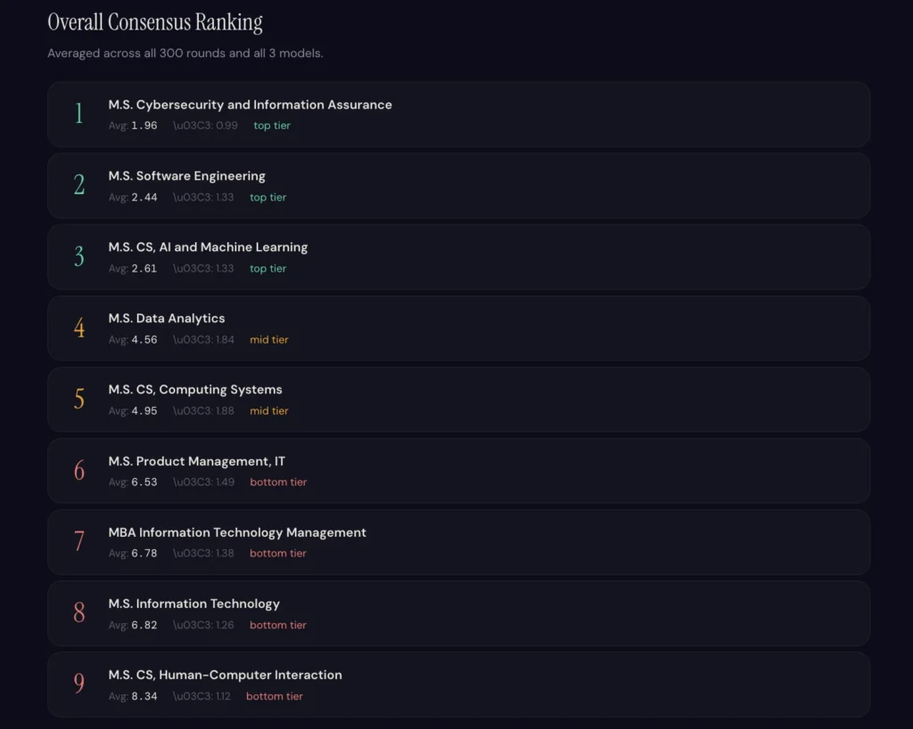

#### Table of Contents

## Which WGU Master's Degree Is Actually Worth It?

If you're considering a master's degree from WGU and can't figure out which program to choose — cybersecurity, software engineering, AI/ML, data analytics — you're not alone. The options are overwhelming, and most comparisons online are either outdated or purely opinion-based.

So here's a different approach. I've been through this myself — I hold a master's in cybersecurity from WGU, a few IT-related bachelor's degrees, and a CISSP. I know what it's like to stare at that list of programs and wonder which one is actually worth your time and money. That's exactly why I wanted to answer this with data, not gut feeling.

I asked three separate AI models the same question 300 times and let the results speak for themselves. This article breaks down the full ranking of all 9 WGU IT master's programs — so you can make a more informed decision about where to invest.

## Why Ask an AI 300 Times? Here's the Method

### The Problem With Asking an LLM Just Once

Large language models don't give you the same answer every time. Ask the same  
question twice and you'll often get two slightly different responses. That means  
a single query isn't reliable enough to base a major career decision on.

To get around this, the following approach was used:

- Three models were tested: GPT-4o, GPT-5.1, and GPT-5.2
- Each model was asked the same ranking prompt 100 times each (300 total)
- Every response included a written justification explaining why each degree  
  was ranked where it was
- All results were aggregated into a spreadsheet to calculate average rankings  
  and standard deviation

The result: **a statistically grounded consensus rather than a one-off opinion.**

### What Each Degree Was Evaluated On

Every prompt included the full curriculum details for each WGU program — pulled  
directly from WGU's official website — so the models weren't just guessing.  
They evaluated each degree against five criteria:

- Job demand (current market need)
- Salary potential (earning impact post-graduation)
- Versatility (applicability across industries and roles)
- Automation resistance (how likely the role is to be disrupted by AI)
- Growth trajectory (projected demand over the next several years)

## WGU Master's Degree Rankings 2026 — Full Results

### Overall Ranking (All 9 Programs)

Were you born into a wealthy family? Middle class? Or in poverty?  
Here's the truth: you didn't choose this. I didn't choose my starting point either. Nobody did.

You can't control where you started. But you can control where you go from here. So acknowledge it, accept it, and move on.

 

The full spreadsheet and detailed analysis report from this study are available to see below.

📊 [See the full data and analysis report](https://docs.google.com/document/d/1qEYhWI4zx_ELCZNDypXcla37GNHTf6UfBauU3DyY-sA/edit?tab=t.0)

### The Top 3 Are Extremely Close — Don't Overthink It

One of the most important takeaways from this data is just how tight the spread  
is at the top. The gap between #1 (1.96) and #3 (2.61) is less than one point.

If you're trying to "min-max" your degree choice, the honest answer is: any of  
the top three will serve you well. The more important factor is which program  
aligns with your career goals and existing skill set.

## #1: MS Cybersecurity and Information Assurance — Consistently Dominant

### Why It Ranked First in 90% of Justifications

The cybersecurity master's wasn't just the overall winner — it was remarkably  
consistent. With a standard deviation of just 0.99, it ranked #1 or #2 in  
almost every single one of the 300 responses across all three models.

In 90% of the written justifications, the models cited cybersecurity by name as  
the top-ranked degree. The reasoning was consistent: strong and growing job  
demand, high salary ceilings, and a field that becomes more critical — not less  
— as organizations become more digitally dependent.

### One Important Caveat: Certifications Often Matter More Than the Degree

That said, it's worth being honest about something: in the cybersecurity field,  
a master's degree is rarely the deciding factor in getting hired.

Certifications like the CISSP are widely considered more valuable than a  
graduate degree when it comes to practical hiring decisions. The degree helps —  
but it's one piece of the puzzle, not the whole picture. Hands-on experience and  
recognized certifications tend to carry more weight with employers.

## #2: MS Software Engineering — Not Dead. Just Evolving.

### "Software Engineering Is Dead" — Why That Take Is Wrong

You've probably heard it: AI is going to replace software engineers. While  
there's a kernel of truth here, the full picture is more nuanced.

The old way of doing software engineering — writing every line of code manually,  
working in isolation from AI tools — is changing fast. In some respects, it's  
already changed. But that doesn't mean software engineering as a discipline is  
disappearing.

### What the New Software Engineer Actually Does

The role is being redefined, not eliminated. Going forward, software engineers  
will increasingly focus on:

- Orchestrating AI tools and LLMs to generate, review, and integrate code
- Providing accurate context and requirements so AI produces useful output
- Migrating legacy systems and building new infrastructure alongside AI
- Making architectural decisions that AI tools alone can't reliably make

The newer models — GPT-5.1 and GPT-5.2 — actually ranked software engineering  
first in their individual results, citing broad applicability and strong demand  
heading into 2026. The most up-to-date AI, it seems, is bullish on software  
engineering's future.

## #3: MS Computer Science – AI and Machine Learning — The Personal Pick

If the author of this analysis were choosing a second master's degree today  
(having already completed the cybersecurity MS), this would be the one.

It ranks third overall — not because it lacks value, but because the current  
job market for dedicated AI/ML roles is slightly narrower than cybersecurity or  
software engineering. However, on a forward-looking basis, the growth trajectory  
here is arguably the strongest of any program on the list.

As AI continues to penetrate every industry, the people who can actually design,  
implement, and improve AI systems will become increasingly valuable. If you're  
optimizing for where the market will be in five years rather than where it is  
today, this program deserves serious consideration.

## Programs #4 Through #9 — Quick Reference

These programs aren't bad choices — they're just more specialized or have a  
lower overall ROI compared to the top three.

**#4 MS Data Analytics**: Strong for data-driven business roles. A solid  
pick if you're targeting analytics or BI positions.

**#5 MS CS – Computing Systems**: Best suited for infrastructure, embedded  
systems, or low-level engineering roles.

**#6 MS Project Management**: A good option if you're transitioning from a  
technical role into management. Less differentiated in a crowded market.

**#7 MBA in IT Management**: Bridges business and technology. Useful for  
leadership tracks, but the ROI is lower than the technical master's programs.

**#8 MS Information Technology**: Broad and flexible, but harder to  
differentiate yourself with this credential alone.

**#9 MS CS – Human-Computer Interaction**: A niche program best suited for  
UX research or product design roles. High specialization, limited scope.

## The Job Market Isn't Broken — Your Approach Might Be

A common frustration among job seekers right now is the sense that something is  
wrong with the market — that the hiring process is broken, that applications  
disappear into a void, that getting a job is harder than it should be.

Here's a more useful way to look at it: the market has changed, not broken.

AI is raising the bar for what employers expect from tech professionals. The  
strategies that worked three or five years ago — the same resume formats, the  
same skill sets, the same job search playbook — are simply less effective now.  
That's not a malfunction. It's evolution.

What actually moves the needle in 2026:

- Learning to use AI tools fluently within your area of specialization
- Building visible proof of your skills (portfolio, open-source work, content)
- Applying with consistency, volume, and genuine alignment to the roles you target

If you stay marketable and keep executing, results follow. Blaming the market  
is a mindset that keeps you stuck.

### Final Takeaway: Which WGU Master's Should You Choose?

Based on 300 AI-generated rankings across three models, the top three WGU  
master's programs in 2026 are:

> #1 MS Cybersecurity and Information Assurance  
> #2 MS Software Engineering  
> #3 MS CS – AI and Machine Learning

These three are separated by less than one point on average — meaning any of  
them is a strong choice. The deciding factor should be your personal career  
direction, not minor differences in aggregate scores.

And regardless of which program you choose, remember: the degree is a tool, not  
a guarantee. Pair it with relevant certifications, real hands-on experience, and  
a genuine ability to leverage AI in your field — and you'll be in a strong  
position no matter where the market goes next.
